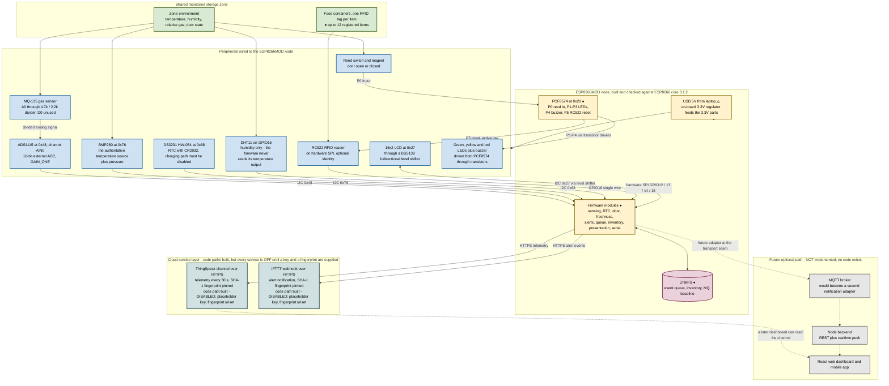
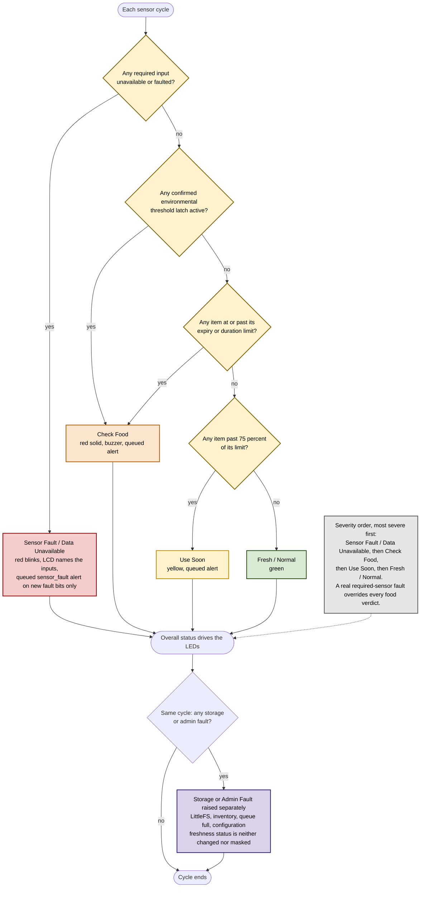
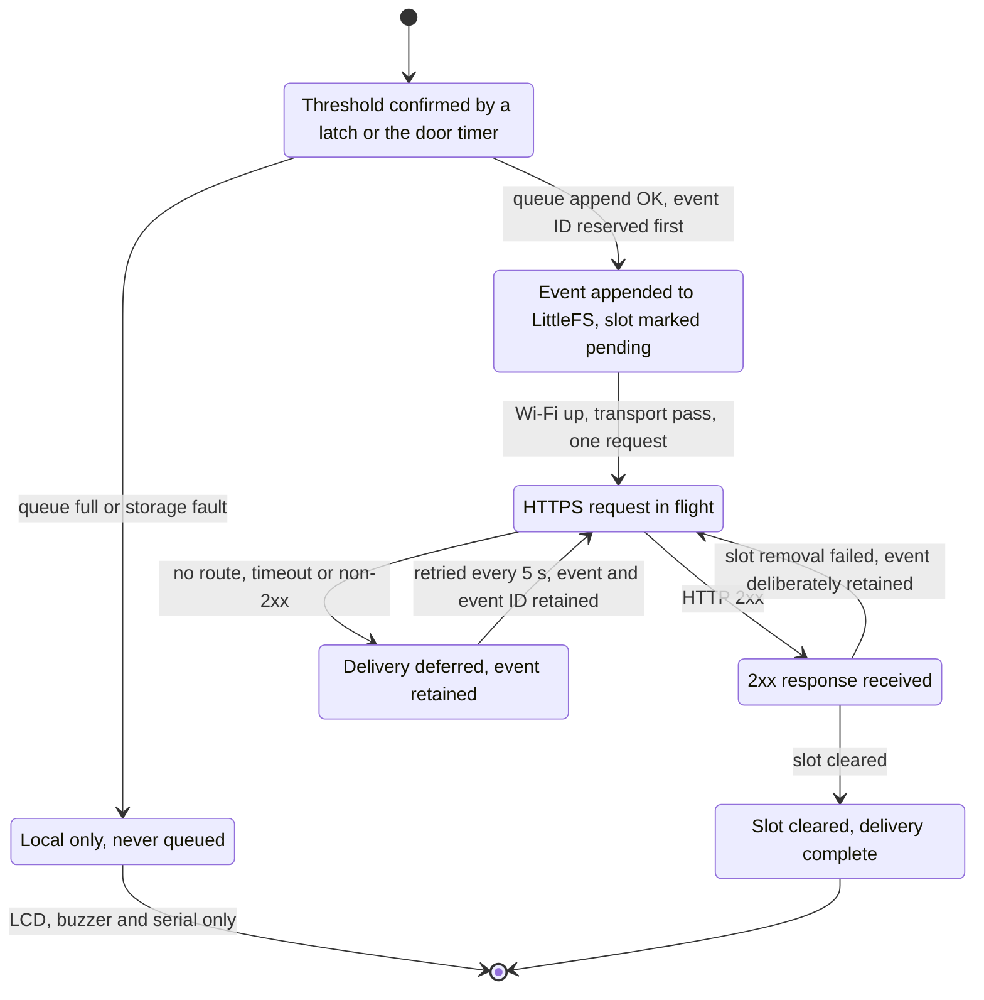
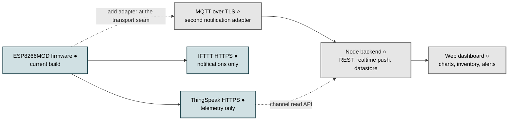

# FreshGuard — Food Storage Monitoring System Architecture

> **Theme:** Zero Food Waste | **Category:** Smart IoT Revolution
> **Competition:** TechWiz 7 (Aptech) | **SRS Version:** 1.0
> **Controller:** ESP8266MOD (NodeMCU / D1-style development board), built and checked against **Arduino ESP8266 core 3.1.2**. That version is the compile environment used for this build's verification, **not** a guarantee of the core installed on your machine — see §5.3 and Q-11.
> **Board labels are provisional.** The GPIO numbers in §6.1 are authoritative. The silkscreen column is a *common* NodeMCU / D1 naming and must be confirmed against the actual board before power is applied (§6.3, Q-9).
> **Authoritative implementation:** [`FreshGuard.ino`](./FreshGuard.ino) — this document describes that file; where the two disagree, the firmware is correct and this document is wrong.

---

## Table of contents

1. [How to read this document](#1-how-to-read-this-document)
2. [System context and scope](#2-system-context-and-scope)
3. [Architecture overview](#3-architecture-overview)
4. [Component inventory and responsibilities](#4-component-inventory-and-responsibilities)
5. [Firmware module map and seams](#5-firmware-module-map-and-seams)
6. [Pin mapping, I2C addresses and boot cautions](#6-pin-mapping-i2c-addresses-and-boot-cautions)
7. [Power, electrical safety and signal integrity](#7-power-electrical-safety-and-signal-integrity)
8. [Data flow, offline behaviour and the event queue](#8-data-flow-offline-behaviour-and-the-event-queue)
9. [Freshness and alert decision semantics](#9-freshness-and-alert-decision-semantics)
10. [Local presentation contract](#10-local-presentation-contract)
11. [Telemetry and notification path (current)](#11-telemetry-and-notification-path-current)
12. [Future optional path and dashboard requirements](#12-future-optional-path-and-dashboard-requirements)
13. [Deployment and bring-up order](#13-deployment-and-bring-up-order)
14. [Hardware evidence requirements](#14-hardware-evidence-requirements)
15. [Templates](#15-templates)
16. [SRS traceability](#16-srs-traceability)
17. [Assumptions, known limitations and deviations](#17-assumptions-known-limitations-and-deviations)
18. [Open decisions awaiting confirmation](#18-open-decisions-awaiting-confirmation)

---

## 1. How to read this document

### 1.1 Status legend

Every capability claim in this document carries one of three markers. Nothing in this document implies that hardware has been powered, wired, or measured.

| Marker | Meaning |
|---|---|
| ● | **Implemented.** Present in `FreshGuard.ino` and reachable at runtime. Not necessarily proven on a bench. |
| ○ | **Planned or optional.** Described for completeness, not built. Must never be presented as delivered. |
| △ | **Requires bench verification.** A compile-time configuration value, a datasheet claim, or a wiring assumption that is *not* validated until someone measures it. |
| ✗ | **Not implemented, and out of scope for the mandatory SRS set.** Listed so its absence is a decision, not an oversight. |

### 1.2 No source code in this document

SRS §1.9 requires: *"Documentation should not contain source code."* This document therefore contains **no C++, JavaScript, SQL, or configuration listings**. Behaviour is specified as:

- interface contracts and field schemas (tables),
- named constants and their current values (tables),
- state machines and decision precedence (diagrams),
- prose descriptions of ordering, error modes, and timing.

The only code blocks in this document are Mermaid diagrams, which SRS §1.9 explicitly requires. Hex register values, pin numbers, field names, and threshold constants are **specification data, not source code**, and are presented as tables.

Naming a library call or an interface in prose — for example, referring to the reader's card-presence call, a queue-rescan operation, or a TLS configuration flag by name — is not a source listing. Those names are used to make a behavioural claim precise and checkable, and they are always accompanied by a description of what the call does and when it runs. No statement, function body, declaration, or configuration file content is reproduced.

### 1.3 What this document does not claim

- No physical test has been performed. The firmware itself prints a safety notice at boot stating that a successful build implies nothing about hardware.
- No sensor has been calibrated. Every numeric threshold in §17 is a **controlled prototype/demo assumption** until a measurement is recorded in the §15.1 baseline table.
- No gas concentration value is claimed. The system reports ADS1115 pin millivolts and a delta from a stored baseline. It never reports ppm, and it never claims calibration.
- The cloud credentials and TLS fingerprints in the firmware are placeholders. Telemetry and remote notification are **disabled by construction** until a key *and* a verified certificate fingerprint are both supplied.
- No toolchain or board version is promised. The ESP8266 core version recorded here is the one this build was checked against, and the board silkscreen is a provisional labelling until confirmed on the hardware (Q-9, Q-11).

---

## 2. System context and scope

FreshGuard is a single-zone, single-node prototype for household or small-restaurant food storage. One ESP8266MOD node monitors one shared storage zone (a refrigerator, or an insulated/cooler box per SRS §1.2 Note).

Three constraints shape every design decision in the firmware:

| Constraint | Source | Design consequence |
|---|---|---|
| Sensors may monitor a **shared zone**, not individual containers | SRS §1.2, §1.6-x | Zone readings (temperature, humidity, relative gas) are a *zone* verdict. Item verdicts come from per-item storage date and expiry. A shared MQ-135 is **never** attributed to a specific food item. |
| FreshGuard **does not determine food safety** | SRS §1.4 | No output is phrased as "safe" or "unsafe". Worst case is *Check Food — requires human inspection*. |
| Internet is required **only** for cloud sync and remote notification | SRS §1.5, §1.6-xv | Sensing, freshness analysis, and local alerts never depend on Wi-Fi. Network loss degrades to buffering only. |
| The system must **not show a misleading Fresh/Normal** when data is missing | SRS §1.6-vii, §1.6-xvi | A fourth status, *Sensor Fault / Data Unavailable*, outranks every food verdict. See §9. |
| Thresholds must be cited, or flagged as prototype assumptions | SRS §1.6-x, §1.7 Accuracy | Every threshold is a compile-time constant with a stated provenance. No value is presented as a certified food-safety limit. |

### 2.1 Scope boundary

| In scope | Out of scope (✗ unless noted) |
|---|---|
| One ESP8266MOD node, one storage zone | Multi-zone or multi-node deployment |
| Local sensing, smoothing, validation, fault debounce | ✗ Cloud-side freshness recomputation |
| Freshness decision: Fresh/Normal, Use Soon, Check Food, Sensor Fault | ✗ Spoilage prediction or AI classification |
| Local alerting: LCD, three LEDs, buzzer | ✗ Food-safety certification or recommendation to eat |
| Bounded offline event buffering and at-least-once delivery | ✗ Buffering of high-frequency sensor samples (optional in SRS §1.6-xv, not built) |
| RFID item identity and per-item storage-duration tracking | ✗ QR-code labels (optional in SRS §1.6-i; not built) |
| ThingSpeak telemetry, IFTTT alert notification | ✗ Custom backend, custom web dashboard, mobile app (future path, §12) |
| Serial bench/administrator interface | ✗ Web-based threshold administration |

---

## 3. Architecture overview

**Reading the diagram.** Colour carries the layer: green = the monitored zone, blue = peripherals, amber = the controller node, purple = on-board storage, dark teal = the cloud service layer, grey = the future path. Dotted edges are optional or not implemented. A solid edge means **the code path exists in this build** — it does *not* mean the far end is powered, connected, or enabled.

**A note on the two cloud edges.** Both leave the firmware through one HTTPS-capable client with a host-specific certificate fingerprint pinned, and both are **disabled by construction** in this build: the keys are `REPLACE_ME…` placeholders and both fingerprint enable flags are `false` (see §11.2). The edges are solid because the transport code is present, not because anything is being transmitted today. There is no MQTT client, no broker, no backend server, no web dashboard, and no mobile application anywhere in this build. Those exist only as the ○ future path in §12.

---

## 4. Component inventory and responsibilities

| # | Component | Qty | Role in FreshGuard | Bus / net | Status |
|---|---|---|---|---|---|
| 1 | **ESP8266MOD** development board (NodeMCU / D1 style) | 1 | Single controller. Runs all sensing, decision, alerting, buffering, and transport logic. Hosts the firmware. | — | ● |
| 2 | **DHT11** combined temperature/humidity sensor | 1 | **Humidity only.** The firmware requests the humidity reading and nothing else. It **never reads the DHT11's temperature output** — there is no temperature read and no discarded value anywhere in the code, and no DHT11 temperature appears in any log, alert, or telemetry field. The BMP280 is the sole temperature source. | Single-wire on GPIO16, external pull-up required (§6.1) | ● |
| 3 | **BMP280** temperature/pressure sensor | 1 | **Temperature and pressure.** Supplies the authoritative temperature used for threshold evaluation, plus barometric pressure for context. | I2C `0x76` | ● |
| 4 | **MQ-135** gas/air-quality sensor | 1 | **Relative** gas indication for the shared zone. Monitored as a change from a stored baseline, never as a concentration. Digital output D0 is intentionally left unconnected. | Analog A0 → external 4.7 kΩ / 2.2 kΩ divider → ADS1115 AIN0 | ● |
| 5 | **ADS1115** 16-bit ADC | 1 | External ADC for the MQ-135 analog signal. Provides the resolution, range, and instrumentation the ESP8266's single noisy 10-bit ADC cannot. **Additional part, not in the SRS bill of materials** (see §17.3). | I2C `0x48`, channel AIN0, GAIN_ONE ±4.096 V, 128 SPS | ● |
| 6 | **DS3231** RTC module, HW-084 style | 1 | Authoritative wall-clock time for storage durations, alert timestamps, and door-open timing across controller power loss. | I2C `0x68` | ● |
| 7 | **CR2032** coin cell | 1 | RTC backup. ⚠ **The HW-084 board can charge this primary cell from 5 V/VIN. The charging path must be disabled and verified before power is applied.** | — | △ critical |
| 8 | **Reed switch** with magnet | 1 | Detects door open/closed. Contacts wired between PCF8574 P0 and ground; closed reads LOW. | PCF8574 P0 (input) | ● |
| 9 | **PCF8574** I/O expander | 1 | Provides the input and outputs the ESP8266 has no spare pins for. Directly addressed over I2C with register-level access; every output write is read back and verified. | I2C `0x20` | ● |
| 10 | **RC522** RFID reader | 1 | Identifies which registered food item is being inspected. Optional function — a reader fault degrades identity only, never freshness. | Hardware SPI: MISO `GPIO12`, MOSI `GPIO13`, SCK `GPIO14`, NSS `GPIO15`; RST on PCF P5 | ● optional |
| 11 | **16×2 character LCD** (HD44780 with I2C backpack) | 1 | Displays sensor readings, zone and overall status, the selected item, and fault names. | I2C `0x27` via BSS138 bidirectional level shifter | ● |
| 12 | **LED indicators** | 3 | Green = Fresh/Normal, Yellow = Use Soon, Red = Check Food. Red **blinks** for Sensor Fault/Data Unavailable. | PCF8574 P1 / P2 / P3 via transistor drivers | ● |
| 13 | **Buzzer** | 1 | Audible local alert. | PCF8574 P4 via transistor driver | ● |
| 14 | **Resistor divider** 4.7 kΩ / 2.2 kΩ | 1 | Attenuates MQ-135 A0 into the ADS1115 input range. Values are placeholders until the fitted resistors are measured. | MQ-135 A0 → ADS1115 AIN0 | △ |
| 15 | **BSS138 bidirectional level shifter** | 1 | Translates 3.3 V I2C for the 5 V LCD module. Provisionally assumed to be a bidirectional BSS138-type shifter; the actual part is unknown. | LCD I2C | △ critical |
| 16 | **Pull-up resistors** 4.7 kΩ–10 kΩ | 3 | Two I²C bus pull-ups to 3.3 V, plus the DHT11 DATA pull-up. The DHT11 resistor is **required** unless the breakout already carries one — the firmware never enables a software pull-up, and GPIO16 does not provide a usable one, so nothing in software can substitute for it. | I2C, GPIO16 | △ |
| 17 | **USB power from a laptop** | 1 | Supplies 5 V to the development board. The on-board regulator produces the 3.3 V rail. | — | ● |
| 18 | **Flyback diode** for the reed coil | 1 | Protects P0 from the inductive kick when the reed coil de-energises. Cathode to the P0-connected coil side, anode to ground. Verify polarity before assembly. | PCF8574 P0 | △ |
| 19 | Breadboard, jumper wires | 1 set | Prototype interconnection. | — | ● |
| 20 | Insulated box / cooler (substitute for a refrigerator) | 1 | Storage environment, permitted by SRS §1.2 Note. | — | ○ |

### 4.1 Explicitly unused

| Net | Why it is unused |
|---|---|
| **ESP8266 A0 (analog input)** | The MQ-135 analog output is **never** connected to the ESP8266 A0. The ESP8266's single 10-bit ADC has a narrow usable input window, poor noise performance, and no instrumentation amplifier. The ADS1115 replaces it. This is a hard rule, stated in the firmware header. △ Verify nothing is attached to A0 during final wiring. |
| **MQ-135 D0 (digital threshold output)** | Digital output compares against an on-module potentiometer with no traceability to the zone baseline. The analog path carries a documented baseline and delta instead. |
| **RC522 IRQ** | Passed to the library as an unused pin. The card poll is a bounded synchronous exchange, so an interrupt is not needed — but the poll does occupy the loop for the duration of the transaction. See §5.2. |
| **PCF8574 P6, P7** | Configured as inputs and left unconnected. Reserved for expansion. |
| **ESP8266 GPIO0, GPIO1, GPIO2, GPIO3** | Boot-mode, UART0, and download pins. Deliberately not used by any peripheral. See §6.3. |

---

## 5. Firmware module map and seams

The firmware is organised as a set of modules with small interfaces. The purpose of listing them here is **locality**: each rule below lives in exactly one place, so a change to a threshold, a debounce count, or a transport contract has one home.

| Module | Interface (what callers must know) | Implementation it hides | Deep or shallow |
|---|---|---|---|
| **Board configuration** | Named pin/address constants plus a startup self-check that returns pass/fail | Compile-time assertions on pin distinctness, I2C address collision, hysteresis adequacy, divider ordering, P0 input direction, reed closed level | Deep — a caller learns four pin numbers, not the whole conflict matrix |
| **I²C bus access** | `probe(address)`, `read8(address, register)`, `write8(address, register, value)` | Wire transaction sequencing and error mapping | Deep |
| **PCF8574 I/O module** | `setOutputActive(pin, active)`, `setRawBit(pin, level)`, read either PCF register | Config-register programming, **write-then-read-back verification**, debounced read/write fault tracking, output-shadow retention on failure, active-high/active-low compile-time polarity | Deep — the LED and buzzer modules never learn about quasi-bidirectional ports |
| **Environmental sensing** | Current `temperatureC`, `pressureHpa`, `humidityPct` plus a validity flag per signal | Sensor drivers, plausibility windows, exponential smoothing, fault debounce (3 failures to raise, 3 successes to clear) | Deep |
| **MQ-135 gas module** | `mqState`, `mqInputMv`, `mqDeltaMv`, `mqAdcCode`, `mqBaselineMv` | Warm-up timer, baseline capture, ADS1115 re-initialisation retries, plausibility rejection, delta computation, CRC-protected baseline persistence, automatic re-baseline after a fault | Deep — this is the most complex module in the firmware and it presents four numbers |
| **RTC time module** | `currentRtcEpoch()` — 0 when time is not trustworthy | DS3231 init, oscillator-stopped flag handling, epoch sanity floor, build-time set gate, `RTCEPOCH` correction path | Deep |
| **Door input module** | `doorOpen`, `doorOpenSinceMs` | 50 ms polling, 80 ms debounce, open-cycle tracking for one-shot door alerts | Deep |
| **Freshness decision module** | `zoneStatus`, `calculateOverallStatus()`, `analyseItemDuration(item, now)` | Availability masks, confirmed threshold latches with hysteresis and a 60 s rearm, 75 % use-soon point, severity ordering | Deep — the single most important module |
| **Alert module** | `raiseAlert(type, message)` | Event construction, RTC timestamping, field sanitisation, queue hand-off, local presentation, local-only fallback when the queue cannot accept the event | Deep |
| **Event queue module** | `append`, `peek`, `remove`, `refreshCount`, `initialize` | LittleFS slot layout, header and slot magic, CRC32 integrity, event-ID reservation, capacity bounding | Deep |
| **Inventory store module** | `registerFoodRecord(fields)`, `removeFoodRecord(uid)`, `listInventory()` | Validated pipe-delimited text file, field sanitisation, store-date preservation on update, transactional save-or-rollback | Deep |
| **Local presentation module** | `updateLcd(now, status)`, `serviceStatusLeds(status, now)`, `scheduleBuzzer(times, onMs, offMs)` | LCD paging, alert overlay, red-blink cadence, buzzer On/OffGap state machine | Deep |
| **Serial command module** | Line-oriented commands over 115200 baud | Non-blocking line buffer with overflow detection, command dispatch, argument parsing | Deep |
| **Transport seam** | A transport record with a name, a `configured()` predicate, and a `send(event)` function | One adapter today: IFTTT HTTPS. The ThingSpeak telemetry path sits beside it | **Real seam, single adapter** — see §5.1 |
| **Configuration / secrets** | Placeholder constants plus a `configuredSecret()` predicate | The interlock that keeps transport disabled until keys *and* fingerprints exist | Deep |

### 5.1 Why the transport seam matters

The notification transport is expressed as a small record — a name, a configured-check, and a send function — with exactly one adapter behind it today. Under the "deletion test", a seam with one adapter is still only a *hypothetical* seam: delete it and nothing changes, because only one thing would be behind it. That is acceptable here because the seam is what makes the MQTT path in §12 a one-module change rather than a firmware rewrite. A second adapter makes the seam real and pays for itself. Until then, the abstraction is deliberately thin and must not be allowed to grow speculative generality (extra retry policies, pluggable serialisers, priority lanes) that has no second consumer.

### 5.2 Main loop and timing

The loop is **cooperative and time-sliced**: every periodic job owns its own last-run timestamp, returns immediately when it is not due, and the pass ends with an explicit yield. What the loop is **not** is strictly non-blocking. Several jobs call synchronous, bounded APIs, and those calls take real time out of the pass in which they run. Saying "cooperative" and saying "non-blocking" are different claims, and only the first one is true here.

**Every synchronous call in the steady-state loop, classified:**

| Work | Where it runs | Nature | Effect on the loop |
|---|---|---|---|
| HTTPS request (`GET` / `POST`) | Steady state | Synchronous, bounded by a 2 s client timeout | The dominant stall. Isolated behind the transport seam and rate-limited to one request per pass. |
| **LittleFS queue and store I/O** | Steady state | **Synchronous.** Each slot read is a full `open` → `seek` → `read` → `close` cycle; each write is `open` → `seek` → `write` → `close`. An inventory save rewrites the whole file. | A complete 24-slot rescan is up to 24 open/close cycles. Bounded and short, but it is time taken from the pass, not a deferred operation. This is the cost of the durability guarantee in §8.2. |
| **MFRC522 card poll** | Steady state, every 500 ms | **Synchronous.** `PICC_IsNewCardPresent` then `PICC_ReadCardSerial` are blocking SPI exchanges with the reader. | Brief, and unavoidable without an interrupt. The reader is polled on a fixed cadence, so this cost recurs every 500 ms for the life of the session. |
| DHT11 single-wire read | Steady state, every 5 s | Synchronous, single-wire transaction | Millisecond scale. |
| I²C transactions (BMP280, DS3231, ADS1115, PCF8574) | Steady state | Synchronous on a 100 kHz bus | Brief and bounded by the bus clock. |
| RC522 post-reset wait | **Setup only** | One 50 ms wait, after the reset line is released | **Never in the loop.** The reset pulse is issued from setup only and never called again, so the reader is held out of reset for the whole session and polled afterwards. |

**The single setup-only delay.** The 50 ms wait is the MFRC522 oscillator start-up time after the reset line is de-asserted. It happens once, during setup. It is the **only** deliberate wait in the firmware — there is no delay-based wait anywhere in the steady-state loop. Everything else that occupies the loop is the bounded cost of a synchronous library call, listed above.

| Periodic job | Interval | Notes |
|---|---|---|
| Serial command intake | Every loop pass | Non-blocking; 256-byte line cap with overflow discard. A command that writes data (`REG`, `REMOVE`) triggers a synchronous whole-file save. |
| Wi-Fi status and re-association | Every loop pass; retry every 10 s | `WiFi.begin()` starts the connection and returns; completion is polled |
| Environmental poll (BMP280 temperature/pressure, DHT11 **humidity only**) | 5 s | Also drives threshold evaluation |
| DS3231 poll | 60 s | |
| Reed switch poll | 50 ms, with 80 ms debounce | |
| MQ-135 service | 5 s in steady state, 1 s during baseline capture | 4 samples averaged per steady-state pass, 1 per baseline pass |
| RC522 card poll | 500 ms | Synchronous SPI; see the classification table above |
| Alert queue rescan | On every append, every removal, and on `QUEUECOUNT` | Bounded linear scan of all 24 slots, each a synchronous open/seek/read/close |
| Inventory file save | On `REG` / `REMOVE` only | Synchronous whole-file rewrite; never reached from the steady-state path |
| LCD page rotation | 2.5 s per page, 5 pages | Alert overlay pre-empts paging for 10 s |
| Buzzer state machine | On each 200 ms/150 ms deadline | |
| Alert transport retry | 5 s while events are pending | |
| ThingSpeak telemetry | 30 s | ThingSpeak's minimum acceptable interval is 15 s |
| HTTP request timeout | 2 s | |

**What this costs in practice.** Every item above is bounded and short relative to the job intervals, so the cooperative design still holds: no job waits for another, and a slow pass delays the *next* pass by milliseconds rather than seconds. The one operation that can cost seconds is an HTTPS request, and that is already isolated, rate-limited, and given an explicit timeout. The design is **cooperative with bounded synchronous stalls**, not strictly non-blocking — and if a future revision needs a hard latency guarantee on the alert path, the seam to move is the transport, not the loop.

**Alert latency, stated precisely.** SRS §1.7 asks for a local alert within 2–5 s *of a confirmed threshold violation*, and that is what the firmware delivers: a confirmed latch raises its alert inside the same evaluation pass that confirms it, so the buzzer, LED, and LCD respond in well under a second of confirmation. End to end from the *start* of a sustained excursion it is longer, because a violation must survive 3 consecutive samples at the 5 s poll cadence — roughly 10–15 s to detection, plus the rearm rules in §9.5. Test rows T-02 and T-03 therefore measure from confirmation, not from the moment the reading first moved.

**Transport scheduling consequence (worth stating explicitly):** when queued alert events exist and the notification transport is configured, that pass delivers **one** event and returns. Telemetry is sent on an alternate pass. Under a sustained alert backlog, telemetry is therefore rate-limited by backlog drain rather than by the 30 s interval. This is deliberate — alerts outrank telemetry — but it is a real behaviour, not a defect.

### 5.3 Build environment — what is verified and what is not

| Item | Status | What that means |
|---|---|---|
| ESP8266 core version | **Verified against 3.1.2.** One specific behaviour was checked in that version: the Wi-Fi start call returns without waiting for association, and association is polled separately. | This is the compile environment used for this build's checks. It is **not** a claim about the core installed on your machine, and it is **not** a guarantee that an older or newer core behaves identically. Record the core version you actually compile against. See Q-11. |
| Third-party library versions | **Not pinned.** Sensor, RTC, LCD, and RFID libraries are named by function in the firmware header, not by version. | A different library release can change a driver detail. Compile and smoke-test before the demo, and record the resolved versions. See Q-11. |
| Board silkscreen labels | **Provisional.** §6.1 gives authoritative GPIO numbers plus a *typical* silkscreen column. | GPIO numbers are what the code depends on. The labels are the common NodeMCU 1.0 / D1-mini naming and must be confirmed against the actual board. See §6.3 and Q-9. |
| Behaviour of the code itself | Verified by reading the source, which is the authority for this document. | Nothing here has been executed on hardware. See §14. |

---

## 6. Pin mapping, I2C addresses and boot cautions

### 6.1 Controller pin map

GPIO numbers are authoritative. The board silkscreen column is a **provisional** common NodeMCU 1.0 / D1-mini labelling and **must be confirmed against the actual board** before power is applied — the firmware header repeats this warning, and the labels vary between development boards of the same family. If your board's silkscreen disagrees with this table, the table's GPIO numbers win and the silkscreen is what needs re-reading. See Q-9.

| ESP8266 GPIO | Typical silkscreen | Net | Direction (firmware) | Electrical requirements | Status |
|---|---|---|---|---|---|
| GPIO4 | D2 | I²C SDA — shared by BMP280, DS3231, ADS1115, PCF8574, LCD | Bidirectional, 3.3 V | 4.7 kΩ–10 kΩ pull-up to **3.3 V only**. Never pull to 5 V. | ● △ pull-up |
| GPIO5 | D1 | I²C SCL — same devices | Output / open-drain | 4.7 kΩ–10 kΩ pull-up to 3.3 V. Bus clocked at 100 kHz for breadboard and shifter margin. | ● △ pull-up |
| GPIO16 | D0 | DHT11 DATA | Bidirectional single-wire | **External 4.7 kΩ–10 kΩ pull-up to 3.3 V, required unless the breakout already carries one.** The firmware never enables a software pull-up and GPIO16 does not provide a usable one, so there is no software fallback. Idle level must read 3.3 V, not floating. | ● △ pull-up |
| GPIO12 | D6 | RC522 MISO | Input | Not a boot-strapping pin. | ● |
| GPIO13 | D7 | RC522 MOSI | Output | | ● |
| GPIO14 | D5 | RC522 SCK | Output | | ● |
| GPIO15 | D8 | RC522 NSS (SS) | Output | **Must be LOW at reset.** The firmware drives it HIGH after boot. △ Check the module for an onboard pull-up. | ● △ caution |
| **A0** | A0 | **UNUSED** | — | **Must remain unconnected.** MQ-135 A0 goes to the ADS1115, never here. | ● rule |
| 3V3 rail | 3V3 | 3.3 V power | Power | Supplies BMP280, DHT11, ADS1115, DS3231, PCF8574, RC522 logic, and the I²C pull-ups. △ MQ-135 is deliberately **not** on this list — see §7.3. | ● △ capacity |
| GND | GND | Common ground | Power | Single common ground across all modules. | ● |
| 5V / VIN | VIN, 5V | USB 5 V input | Power | Powers the board regulator. **The ESP8266 is not 5 V tolerant** — never route 5 V to a GPIO. | ● |
| GPIO0, GPIO1, GPIO2, GPIO3, EN, RST | D3, TX, RX, EN, RST | **Reserved** | — | Boot-mode, UART0, and auto-program pins. No peripheral may connect here. | ● rule |

**Pin conflict check.** GPIO4, GPIO5, GPIO12, GPIO13, GPIO14, GPIO15, and GPIO16 are all distinct, and the DHT pin differs from both I²C pins. This is enforced at compile time, so a bad edit fails the build rather than producing a mis-wired board.

### 6.2 PCF8574 pin map

Configuration register value `0xC1` is written at startup and read back. In the PCF8574 configuration register, a 1 means input/high-impedance and a 0 means quasi-bidirectional output.

| Pin | Direction | Net | Driver / protection requirement | Polarity |
|---|---|---|---|---|
| P0 | **Input** | Reed switch contacts to ground | Quasi-bidirectional pull-up is weak (~100 µA typical). △ Add an external 10 kΩ pull-up to 3.3 V if the reading is unstable. Flyback diode across an inductive coil: cathode to the P0-connected side, anode to ground. | Contacts closed = LOW = door closed |
| P1 | Output | Green LED (Fresh/Normal) | **Never** connect a high-current LED directly to a quasi-bidirectional port. Use an NPN/NMOSFET driver plus a 220–330 Ω series resistor. | Active high by default |
| P2 | Output | Yellow LED (Use Soon) | Same driver requirement. | Active high |
| P3 | Output | Red LED (Check Food), and the blink indicator for Sensor Fault | Same driver requirement. | Active high |
| P4 | Output | Buzzer | Transistor driver plus flyback protection across an inductive element. | Active high |
| P5 | Output | RC522 RST | Logic-level input; may be driven directly. | **Active low** |
| P6, P7 | Input | Unused | Leave open. | — |

**Polarity correction.** A single compile-time constant declares whether the controlled outputs are active-high or active-low. If the transistor drivers invert a signal, flip that one constant and re-test; do not scatter `NOT` operations through the presentation code.

**Verified writes.** Every output write is followed by a read of the input register, which reflects actual pin levels. A mismatch is treated as a genuine bus or load fault rather than a successful write, and the cached shadow is *not* updated, so a later attempt retries the failed transition. This is why an LED or buzzer that fails to switch raises a real fault instead of being silently believed to have worked.

### 6.3 ESP8266 boot and strapping cautions

| Caution | Detail | Required action |
|---|---|---|
| **GPIO15 must be LOW during reset** | The ESP8266 samples GPIO15 at reset to select boot mode. RC522 NSS is wired here. The board provides a pull-down, but some RC522 breakout boards fit a pull-up on the SS line. | △ Before first power-on, measure GPIO15 with the RC522 attached and the board unpowered. If it reads high, remove the module's pull-up or fit a stronger pull-down (e.g. 4.7 kΩ) or drop the reader. |
| **GPIO0 and GPIO2 must stay untouched** | Both are boot-strapping pins. The design avoids them entirely, which is a deliberate strength. | Confirm no jumper lands on D3/GPIO0 or the GPIO2 net during final wiring. |
| **UART0 pins reserved** | GPIO1 (TX) and GPIO3 (RX) carry the 115200-baud serial console that the bring-up procedure depends on. | Do not share them with a peripheral. |
| **EN and RST reserved** | The auto-program circuit must keep working so the board can be re-flashed without soldering. | Do not bridge or load these pins. |
| **I²C pull-ups must reference 3.3 V** | The LCD side of the shifter carries its own pull-ups to 5 V; the ESP8266 side must have none above 3.3 V. | △ Measure the ESP8266-side idle SDA/SCL levels before connecting the LCD. |
| **Deep-sleep would forfeit GPIO16** | If a future revision adds deep sleep, ESP8266 wake-from-reset is wired to GPIO16 — which this design already uses for the DHT11. | Recorded as a design consequence in §17.4, not a present defect. |

### 6.4 I²C address map

| Address | Device | How the address is set | Conflict |
|---|---|---|---|
| `0x20` | PCF8574 | A0/A1/A2 tied to ground | None |
| `0x27` | 16×2 LCD with PCF8574 backpack | Backpack solder jumpers; configurable | None. If the backpack answers elsewhere, update the constant and re-run the bus scan. |
| `0x48` | ADS1115 | ADDR tied to ground (default) | None. ADDR to VDD / SDA / SCL give `0x49` / `0x4A` / `0x4B`. |
| `0x68` | DS3231 | Fixed | None. Some modules carry an AT24C32 EEPROM at `0x57`; it will appear in the bus scan and can be ignored. |
| `0x76` | BMP280 | SDO tied to ground | None. SDO to VCC gives `0x77`. |

All five addresses are pairwise distinct, and the collision check is enforced at compile time. A bus scan runs automatically at boot and labels any address it finds with the expected device name, so a mis-strapped module is diagnosed in the serial log rather than by guesswork.

---

## 7. Power, electrical safety and signal integrity

> **⚠ None of the checks below have been performed.** Each row is a requirement to be satisfied on the bench and recorded as evidence (§14).

### 7.1 Power distribution checklist

| # | Check | Requirement | Method | Status |
|---|---|---|---|---|
| P1 | Single power source | USB 5 V from the laptop powers the board only. No second supply is connected. | Visual inspection of the wiring | △ |
| P2 | 3.3 V logic rail | The on-board regulator's 3.3 V output supplies BMP280, DHT11, ADS1115, DS3231, PCF8574, RC522 logic, and all pull-ups. | Schematic check + rail measurement under load | △ |
| P3 | Rail capacity | The regulator and USB path must supply ESP8266 Wi-Fi transmit peaks **plus** all peripherals. Wi-Fi bursts are the dominant transient. | Scope the 3.3 V rail during an association and during a ThingSpeak upload; keep adequate margin and add bulk capacitance if the rail sags | △ |
| P4 | 5 V tolerance | The ESP8266 is **not** 5 V tolerant. No 5 V signal may reach any GPIO. | Continuity-check every signal net back to its source rail | △ |
| P5 | Common ground | One common ground for all modules, including the shifter's low side. | Visual + continuity check | △ |
| P6 | Decoupling | 100 nF decoupling close to each module, plus suitable bulk capacitance. | Visual inspection against the breadboard layout | △ |
| P7 | LED current | Series resistors of 220–330 Ω on every LED driven through a transistor. | Visual inspection | △ |
| P8 | LED/buzzer port loading | No high-current LED or buzzer is connected directly to a PCF8574 quasi-bidirectional output. Transistor drivers carry the load; the port only switches the base/gate. | Visual inspection | △ |
| P9 | Reed flyback | Flyback diode across an inductive reed coil: cathode to the P0-connected side, anode to ground. Polarity verified before assembly. | Visual inspection + diode-mode measurement | △ |
| P10 | Reed pull-up | External 10 kΩ pull-up to 3.3 V on P0 if the quasi-bidirectional pull-up proves marginal with real contacts. | Measure the P0 idle level and the closed level | △ |
| P11 | DHT11 pull-up | 4.7 kΩ–10 kΩ pull-up to 3.3 V on DATA, **fitted unless the breakout already carries one.** This is a hardware gate, not a software setting: the firmware cannot add the pull-up. | Measure the idle DATA level with the ESP8266 powered and the DHT connected; it must sit at 3.3 V, not floating. A floating line reads humidity as permanently unavailable, which surfaces as Data Unavailable rather than a wrong number. | △ |
| P12 | I²C pull-up rail | ESP8266-side I²C pull-ups go to 3.3 V. The 5 V side of the shifter carries its own pull-ups. There is **no** ESP8266-side pull-up to 5 V. | Measure idle SDA/SCL on both sides of the shifter | △ |
| P13 | ADS1115 analog ceiling | AIN0 must remain below 3300 mV in **every** state. With the 4.7 kΩ/2.2 kΩ network this corresponds to an MQ-135 A0 of approximately **10.35 V** maximum. The ADS1115 absolute maximum analog input is VDD + 0.3 V. | Scope AIN0 across heater start-up and across a full gas excursion | △ |
| P14 | Divider values | The 4.7 kΩ and 2.2 kΩ resistors are placeholders until the fitted parts are measured. | Measure with a multimeter; update the constants and re-baseline | △ |
| P15 | DS3231 charging path | **Never** power an HW-084 module at 5 V. Many such boards charge the installed primary CR2032 from 5 V/VIN. Disabling the path (per the exact module schematic — usually a resistor, diode, or board link) and confirming with a multimeter that no charging current can reach the cell is **mandatory before power is applied**. | Multimeter: charging-path continuity removed, no current path to the cell | △ **critical** |
| P16 | DS3231 3.3 V operation | At 3.3 V, confirm no onboard pull-up or regulator is tied to 5 V/VIN. | Schematic + multimeter | △ |
| P17 | Level shifter type | The LCD shifter is **provisionally assumed** to be a bidirectional BSS138-type device: low side at 3.3 V, high side at 5 V, pull-ups on each side to its own rail. The actual part is unknown. | Read the part marking and confirm it is bidirectional, not a unidirectional MOSFET shifter | △ **critical** |
| P18 | LCD supply | The LCD module is powered at 5 V **only** once P12 and P17 are satisfied. Until then, leave it unpowered. | Sequencing, not inspection | △ |
| P19 | Condensation and food contact | The MQ-135 and DHT11 wiring stays clear of condensation, moisture, and direct contact with food or water. Sensor bodies are not immersed or splashed. | Visual inspection and mounting choice | △ |
| P20 | Enclosure and placement | The assembly is placed in or near the storage environment with short wiring, without trapping moisture. | Visual inspection | △ |

### 7.2 Why the MQ-135 signal path is a divider plus an external ADC

| Design choice | Reason |
|---|---|
| External divider (4.7 kΩ / 2.2 kΩ) | The MQ-135 analog output is ratiometric to its heater supply and can exceed the ESP8266 pin range. The divider guarantees AIN0 stays under the 3300 mV ceiling. |
| ADS1115 rather than ESP8266 A0 | 16-bit resolution, a programmable gain stage, and an onboard reference — the difference between a usable relative trend and noise. |
| GAIN_ONE (±4.096 V full scale) | Matches the divided signal with headroom. Enforced at compile time; the full-scale constant is asserted to be 4096 mV, not 4096 V. |
| Plausibility window on AIN0 | Readings outside 10 mV … 3300 mV are rejected as implausible and drive a confirmed MQ-135 reading fault. This catches a disconnected sensor reading 0 V and a shorted divider reading full scale. |
| Four-sample average per pass, then smoothing | A 5 s pass averages four back-to-back conversions, and the pass result is smoothed with a 0.25 weight. This is the averaging/smoothing that SRS §1.6-v requires to reduce false alerts. |
| Digital output D0 left unused | A hardwired digital threshold has no traceability to the zone baseline. |

### 7.3 MQ-135 supply voltage — an open question

The firmware's power note deliberately excludes the MQ-135 from the list of parts fed by the 3.3 V rail, and the divider is dimensioned to tolerate an A0 up to about 10.35 V. That is consistent with a breakout intended for a higher heater supply, but the exact module's supply requirement, and the effect of supply voltage on the analog output, are **unknown and unverified**. See §18 for the decision this blocks.

---

## 8. Data flow, offline behaviour and the event queue

```mermaid
flowchart LR
  subgraph READ["1 Acquire"]
    direction TB
    A1["BMP280 temperature and pressure"]
    A2["DHT11 humidity"]
    A3["ADS1115 AIN0 millivolts from MQ-135"]
    A4["DS3231 epoch seconds"]
    A5["Reed door state through PCF8574 P0"]
  end

  subgraph VAL["2 Validate and smooth"]
    direction TB
    B1["Finite and plausibility window per signal"]
    B2["Fault debounce, 3 failures to raise and 3 successes to clear"]
    B3["Exponential smoothing, temperature and humidity 0.20, gas 0.25"]
    B4["Gas state machine: warming, capturing baseline, ready, faulted"]
  end

  subgraph DEC["3 Decide"]
    direction TB
    C1["Confirmed threshold latches plus the door-open timer<br/>3 consecutive samples, hysteresis, 60 s rearm"]
    C2["Zone status from availability and active latches"]
    C3["Item duration status from RTC time and the item limit"]
    C4["Overall status is the most severe of zone and every item"]
  end

  subgraph LOCAL["4 Respond locally, independent of the network"]
    direction TB
    D1["LCD pages plus a 10 s alert overlay"]
    D2["Green, yellow or red LED, red blinks on data unavailable"]
    D3["Buzzer, three beeps of 200 ms on and 150 ms off"]
  end

  subgraph BUFFER["5 Buffer in LittleFS"]
    direction TB
    E1["Alert event carrying an event ID, an RTC timestamp and a validity flag"]
    E2["Bounded 24-slot queue, each slot CRC protected"]
    E3["Event is retained unless a 2xx response arrives"]
  end

  subgraph NET["6 Publish when Wi-Fi is up"]
    direction TB
    F1["HTTPS transport seam, one bounded request per pass, 2 s timeout"]
    F2["ThingSpeak telemetry every 30 s"]
    F3["IFTTT webhook carrying event_id for receiver-side dedupe"]
  end

  A1 --> B1
  A2 --> B1
  A3 --> B4
  A4 --> C3
  A5 --> C1
  B1 --> B2
  B2 --> B3
  B3 --> C1
  B4 --> C1
  B4 --> E2
  C1 --> C2
  C2 --> C4
  C3 --> C4
  C4 --> D1
  C4 --> D2
  C1 --> D3
  C1 --> E1
  E1 --> E2
  E2 --> E3
  E3 -->|"Wi-Fi up"| F1
  F1 --> F2
  F1 --> F3
  E3 -.->|"no Wi-Fi, no route or non-2xx: retained and retried every 5 s"| E2

  classDef read fill:#CFE2F3,stroke:#0B5394,stroke-width:2px,color:#000000
  classDef val fill:#D9EAD3,stroke:#274E13,stroke-width:2px,color:#000000
  classDef dec fill:#FFF2CC,stroke:#7F6000,stroke-width:2px,color:#000000
  classDef loc fill:#FCE5CD,stroke:#B45F06,stroke-width:2px,color:#000000
  classDef buf fill:#EAD1DC,stroke:#741B47,stroke-width:2px,color:#000000
  classDef net fill:#D0E0E3,stroke:#0C343D,stroke-width:2px,color:#000000

  class A1,A2,A3,A4,A5 read
  class B1,B2,B3,B4 val
  class C1,C2,C3,C4 dec
  class D1,D2,D3 loc
  class E1,E2,E3 buf
  class F1,F2,F3 net
```

### 8.1 What continues offline

| Capability | Offline behaviour | SRS basis |
|---|---|---|
| Sensor acquisition | Unaffected. All six polled signal paths run locally on their own schedules: BMP280 temperature, BMP280 pressure, DHT11 humidity, MQ-135 via the ADS1115, DS3231 time, and the reed door input. (The RC522 identity poll is a seventh, optional path.) | §1.5, §1.6-xv |
| Freshness analysis | Unaffected. Uses local readings and the DS3231 clock. | §1.6-xv |
| Local alerts | Unaffected. Buzzer, LEDs, and the LCD alert overlay fire on confirmation. | §1.6-xii, §1.6-xv |
| Door monitoring | Unaffected, including the door-open timeout and buzzer. | §1.6-vi |
| Alert events | **Buffered, not lost.** Appended to the LittleFS queue and retried. | §1.6-xv |
| High-frequency sensor samples | **Not buffered.** Telemetry during an outage is not stored. SRS §1.6-xv makes this optional ("may also be buffered where local storage capacity permits"). | §1.6-xv |
| Remote notification | Suspended. Events accumulate; delivery resumes on reconnection. | §1.6-xii |

### 8.2 The event queue contract

| Property | Contract |
|---|---|
| Location | `/fg_events.bin` in LittleFS |
| Layout | One fixed-size header (magic `FG01`, version, capacity, next event ID, reserved) followed by a fixed array of 24 fixed-size slots (slot magic `FQE1`, sync state, time-valid flag, event ID, timestamp, type, message, CRC32). |
| Bounded by design | Capacity is a compile-time constant of 24. There is no growth path and no unbounded allocation. |
| **Event ID** | A 32-bit counter is **reserved and written to the header before the slot write**. A failed slot write therefore *skips* an ID rather than risking a duplicate. The counter lives in the file header and is reloaded at boot, so **IDs are not reused after a reset** and the reserve-before-write ordering makes a duplicate-after-reset impossible in normal operation. **Uniqueness is not absolute, though:** the counter wraps back to 1 when it reaches its 32-bit maximum, so a theoretical wrap boundary exists. At a realistic alert rate — one event per rearm window, not one per second — that boundary is far beyond any deployment lifetime, but the honest statement is "unique for normal operation", not "provably never collides". |
| Timestamp | DS3231 epoch seconds, with a separate `timeValid` flag. A zero timestamp means "time was not trustworthy when this was raised", not "epoch zero". |
| **Failed events are retained** | A slot is marked pending on write and is cleared **only** after a 2xx response. Timeout, no route, or a non-2xx status leaves the slot pending. |
| 2xx but failed local removal | The event is **retained** and logged. The remote copy exists, so this deliberately produces a duplicate rather than a silent loss. |
| **Delivery semantics** | **At-least-once, with bounded retention.** An unacknowledged event is never dropped: it stays pending until a 2xx clears it. The guarantees the device actually provides are therefore (a) a bounded number of events are retained on flash, and (b) each retained event carries an event ID the receiver can deduplicate on. **Ordering is *not* part of the guarantee** — see the next row. **The receiver is responsible for deduplicating on `event_id`** and must not assume delivery order. |
| **Delivery order** | **Best-effort by slot index — not a strict FIFO.** The queue is a fixed array of 24 slots scanned linearly, not a linked structure: an append takes the *lowest free* slot, and a delivery pass takes the *lowest pending* slot. While events are appended and retired lowest-index-first — which is what the normal drain does — that is FIFO by construction. It is not an intrinsic property of the structure: any freed lower slot is reused ahead of still-pending higher slots, and a failure to retire a slot leaves later events behind it. Do not build a receiver that depends on strict ordering; order by `event_id` or `timestamp` if you need one. |
| Corruption handling | A CRC mismatch is treated as a LittleFS fault and the event is **retained**, not discarded. Because delivery is a linear scan, a corrupt slot **blocks every event behind it** (head-of-line blocking) rather than being skipped over. So a corrupt event is never silently dropped *and* never silently skipped — it surfaces as a `LittleFS` storage/admin fault, which is the honest outcome. |
| File integrity | On boot, the file size, header magic, version, and capacity are validated. An invalid existing file is **left untouched** for recovery rather than being cleared. |
| Full queue | The queue is reported as a storage/admin fault. The alert that triggered it **cannot itself be queued**, so it is presented locally only. The recursion is broken by the *announced-mask* latch, not by a special case: once a storage bit has been announced it is not announced again, so one overflow produces one local-only alert and not an endless chain. |

### 8.3 What the queue actually guarantees

Stated plainly, because the distinction is easy to overstate in a design document:

| The device **does** guarantee | The device **does not** guarantee |
|---|---|
| **Bounded retention.** A pending event is never dropped while unacknowledged: it survives a timeout, a missing route, a non-2xx status, and a failed local removal. | **Strict FIFO order.** Delivery is a scan of 24 fixed slots and ordering is best-effort by slot index (§8.2). |
| **At-least-once delivery**, with a deliberate preference for a duplicate over a silent loss. | **Strict event-ID uniqueness forever.** IDs are unique for normal operation and are not reused after a reset, but the 32-bit counter has a theoretical wrap boundary. |
| **Recoverable identity.** Each retained event carries a timestamp, a time-validity flag, and an event ID a receiver can deduplicate on. | **Unlimited buffering.** 24 slots is the whole budget; a full queue is an honest reported fault, not a silent drop. |

The honest one-line summary for a report: *bounded retention plus at-least-once event IDs, delivered in best-effort slot order, with the receiver responsible for deduplication.*

### 8.4 On-boot persistence

| File | Contents | Validation on load |
|---|---|---|
| `/fg_events.bin` | Bounded alert queue | Magic, version, capacity, non-zero next ID, exact file size |
| `/fg_inventory.txt` | Pipe-delimited item records with a `FG1` header and a declared count | Field count, numeric ranges, UID hex, expiry not before store date, store date above the epoch floor, name non-empty |
| `/fg_mq_base.bin` | MQ-135 relative baseline | CRC32, magic, version, **and** a match against the compiled divider values, ADC full scale, and baseline sample count |

**A validation gap worth recording:** the persisted gas baseline record fingerprints the divider values, the ADC full scale, and the sample count — but **not the MQ-135 supply voltage**. Changing the heater supply therefore silently invalidates the comparability of a stored baseline without invalidating the record. Bench rule: **re-baseline after any change to the MQ-135 supply, and until that is added to the record, treat the supply as part of the baseline's identity.**

### 8.5 Inventory contract

| Property | Contract |
|---|---|
| Capacity | 12 items maximum, a compile-time constant. |
| Identity | The RFID tag UID (up to 10 bytes) is the primary key. |
| Store date | Set to the current DS3231 time **on first registration**. Re-registering an existing UID updates the metadata and **preserves the original store date** — an accidental re-registration cannot silently reset an item's age. |
| Expiry vs duration | A non-zero expiry epoch takes precedence. An expiry of `0` means "use the configured storage-duration limit". At least one of the two must be provided. |
| Rejected at registration | A non-empty name is required. An expiry in the past is rejected, as is a duration of zero with no expiry. Registration requires a valid DS3231 time. |
| Field sanitisation | Control characters, `|`, `"`, and `\` are replaced with spaces, so a record can never corrupt the file format or inject a separator. |
| Save atomicity | A failed save restores the previous in-memory record and count. |
| **Runtime latch state is RAM-only** | Per-item alert latches reset on reboot, so a Use Soon or Check Food alert may re-fire after a restart. Idempotency across reboots is not guaranteed. See §17.4. |

---

## 9. Freshness and alert decision semantics

### 9.1 The four statuses

SRS §1.6-xi defines three freshness conditions. SRS §1.6-vii and §1.6-xvi require a *separate* data-quality state that must never be presented as "Fresh/Normal". The firmware therefore implements four statuses in a fixed severity order.

| Rank | Status | Meaning | LED | Source |
|---|---|---|---|---|
| 3 | **Sensor Fault / Data Unavailable** | At least one required input is faulted or not yet producing data. The verdict is *unknown*, not *good*. | Red **blinks**; green and yellow off | SRS §1.6-vii, §1.6-xvi |
| 2 | **Check Food** | Human inspection required — either a confirmed environmental threshold violation, or an item at/past its expiry or duration limit. | Red solid | SRS §1.6-xi |
| 1 | **Use Soon** | An item has passed 75 % of its storage-duration or expiry window. | Yellow | SRS §1.6-xi |
| 0 | **Fresh / Normal** | Conditions are inside the configured acceptable range. | Green | SRS §1.6-xi |

The severity order is the whole point: **the most severe status wins.** A real required-sensor fault therefore overrides a *Fresh* reading *and* a *Check Food* reading. When data is missing, FreshGuard says so rather than guessing — that is exactly what SRS §1.6-vii demands, and it is why "any real required sensor fault overrides Fresh" holds by construction rather than by special case.

### 9.2 Where each status can come from

| Status | From the zone (environment) | From an item (storage duration) |
|---|---|---|
| Sensor Fault / Data Unavailable | ● Any required input unavailable or faulted | ● DS3231 time untrustworthy, or a zero-length limit |
| Check Food | ● Any confirmed environmental threshold latch active | ● Now ≥ expiry epoch, or now ≥ store date + duration limit; also now < store date (clock moved backwards) |
| Use Soon | ✗ **The zone can never produce Use Soon** | ● Elapsed ≥ 75 % of the window |
| Fresh / Normal | ● No latch active and all inputs available | ● Elapsed < 75 % of the window |

> **A consequence an evaluator should know.** Use Soon is reachable **only** through registered inventory. With an empty inventory, the overall status equals the zone status, and a Use Soon state cannot occur. The LEDs are driven by the *overall* status, so a zone with no registered items shows green even though nothing is tracked. This is a deliberate single-zone design choice, documented in the firmware header, and it is the reason a demo must register at least one item.

### 9.3 Decision precedence

### 9.4 The three rules that make this trustworthy

| Rule | Implementation | Why it exists |
|---|---|---|
| **A real required-sensor fault overrides Fresh** | `currentSensorUnavailableMask()` is non-zero ⟹ zone status is Sensor Fault, before any threshold evaluation. Sensor Fault is rank 3, so `worstStatus` propagates it to the overall status and it outranks Check Food. | SRS §1.6-vii, §1.6-xvi. A green light on stale or missing data is a lie. |
| **Storage/admin faults are separate and must not mask Check Food** | LittleFS, inventory, queue-full, and configuration faults live in a **different mask** from sensor faults. They never enter the availability mask, never change zone or overall status, and carry the explicit message "freshness status unaffected". Their alert type is `storage_fault`, distinct from `sensor_fault`. | A full queue or a filesystem problem is an *administration* problem. Conflating it with a food verdict would both hide a real spoilage warning and cry wolf about the food. |
| **Warm-up and baseline are Data Unavailable, but never a false remote fault** | During gas warm-up and baseline capture, the MQ-135 bit is added to the **availability** mask (so the display says Data Unavailable) but deliberately **not** to the confirmed-fault mask. Only genuine, debounced read or plausibility failures enter the confirmed mask. Warm-up runs for the full 60 s on **every** boot, including when a valid baseline was persisted — the stored baseline is adopted only once warm-up completes, so the heater is never read cold. | A 60 s heater warm-up and a further ~30 s baseline capture are normal, expected behaviour on every boot. Alerting a remote channel about them would be a false alarm on every single power-up. |

### 9.5 Confirmation, hysteresis, and rearm

| Mechanism | Value | Purpose |
|---|---|---|
| Consecutive-sample confirmation | 3 samples | One bad I²C transaction or one door bounce cannot raise a local or remote alert. Measured from the *first* violating sample to the confirmed alert this is ~10–15 s at the 5 s poll cadence; from *confirmation* to local response it is well under a second. See §5.2. |
| Recovery confirmation | 3 samples | A single lucky read cannot clear a fault. |
| Item-duration confirmation | 3 samples, same latch mechanism, same 60 s rearm | An item's Use Soon / Check Food verdict is confirmed rather than instantaneous, exactly like an environmental threshold. A newly registered item does not alert on its first evaluation. |
| Temperature hysteresis | ±1.0 °C around the limit | At least as wide as the BMP280's ±1 °C tolerance, so the value cannot chatter across the limit from sensor error alone. |
| Humidity hysteresis | ±5 % RH | At least as wide as the DHT11's ±5 % RH tolerance. |
| Gas hysteresis | 50 mV to raise, 40 mV to clear | Two distinct thresholds, deliberately non-equal, so a signal sitting on the limit cannot oscillate. |
| Alert rearm | 60 s | Prevents a flapping condition from generating an alert storm. A *new* fault bit that appears inside the rearm window is logged and suppressed rather than alerted, so a burst of distinct bits cannot storm either. |
| One-shot door alert | Per open cycle | The door alert fires once per open event, not once per poll. |
| Enforced at compile time | Hysteresis ≥ 1.0 °C and ≥ 5 % RH | A build that reduces hysteresis below documented sensor uncertainty fails to compile. |

### 9.6 Alert lifecycle and at-least-once delivery

**Invariant to state to evaluators:** a slot is cleared only after a 2xx. The device never drops an unacknowledged event, and the 2xx-but-failed-removal case intentionally favours a **duplicate** over a **silent loss**. Two things this invariant does *not* buy you, and which a report should not overstate: **ordering is best-effort by slot index**, not strict FIFO (§8.2, §8.3); and event IDs are **unique for normal operation and not reused after a reset, but the 32-bit counter has a theoretical wrap boundary** — "unique for normal operation", not "provably never collides". The receiver deduplicates on `event_id` and must not assume delivery order.

### 9.7 Alert type vocabulary

| `type` token | Raised when | Local action |
|---|---|---|
| `temperature_high` | BMP280 temperature above the prototype maximum, 3 consecutive samples | Buzzer + LCD alert |
| `temperature_low` | BMP280 temperature below the prototype minimum | Buzzer + LCD alert |
| `humidity_high` | DHT11 humidity above the prototype maximum | Buzzer + LCD alert |
| `humidity_low` | DHT11 humidity below the prototype minimum | Buzzer + LCD alert |
| `gas_relative_high` | Gas delta above the prototype delta threshold (AIN0 millivolts, never ppm) | Buzzer + LCD alert |
| `door_open` | Door open beyond the configured timeout, once per open cycle | Buzzer + LCD alert |
| `food_use_soon` | An item passed 75 % of its window | Buzzer + LCD alert |
| `food_check` | An item reached its expiry or duration limit | Buzzer + LCD alert |
| `sensor_fault` | A **new** bit appeared in the confirmed sensor-fault mask | Buzzer + LCD alert |
| `storage_fault` | A **new** bit appeared in the storage/admin mask | Buzzer + LCD alert |

---

## 10. Local presentation contract

### 10.1 LCD

One alert overlay pre-empts the page rotation for 10 seconds after any alert, then pages resume on a 2.5 s cycle.

| Page | Row 0 | Row 1 |
|---|---|---|
| Overlay (10 s, any page) | `ALERT` | Alert message, or `LOCAL ONLY <type>: <message>` if it could not be queued |
| 0 | `T:<value>C P:<value>hPa`, or `BMP280: FAULT` | `Humidity:<value>%`, or `DHT11: FAULT` |
| 1 | `FreshGuard status:` / `Sensor Fault/` | Overall status text, or `Data Unavailable` |
| 2 | Last scanned item's name, or `No food selected` | That item's status (zone verdict combined with its duration verdict), or `Scan registered UID` |
| 3 | `Sensor unavailable:` | Names of inputs in the availability mask, or `none` |
| 4 | `Storage/Admin:` | Names of storage/admin faults, or `none` |

**Design intent.** Zone status and overall status are displayed *separately*, so the reason an overall fault is showing is always visible as text rather than inferred from a colour.

**Two honest caveats about what the LCD shows.** Pages 3 and 4 render fault names into a single 16-character row, so a long fault list is **truncated on screen** — the serial `STATUS` line is the complete, untruncated source, and the ThingSpeak fault mask in §11.3 is the machine-readable one. Separately, `LCD OFF` switches off the backlight *and* stops all page updates, so the display freezes at its last content rather than continuing to refresh dark; `LCD ON` resumes paging.

### 10.2 LEDs and buzzer

| Condition | Green (P1) | Yellow (P2) | Red (P3) | Buzzer |
|---|---|---|---|---|
| Fresh / Normal | On | Off | Off | Off |
| Use Soon | Off | On | Off | Off unless an alert is active |
| Check Food | Off | Off | On solid | 3 beeps, 200 ms on / 150 ms off |
| Sensor Fault / Data Unavailable | Off | Off | **Blinking, 250 ms** | 3 beeps on a new fault transition |
| Any confirmed alert | Per status | Per status | Per status | 3 beeps |

LEDs are driven from the **overall** status (the worst of the zone verdict and every item's duration verdict), not from the zone status alone. The firmware exposes this as a single call site so a reviewer can change the policy in one place.

### 10.3 Serial administration interface

115200 baud, line-oriented, non-blocking. Line length is capped at 256 bytes; an over-long line is discarded with a warning rather than partially executed.

| Command | Purpose |
|---|---|
| `HELP` | List commands |
| `STATUS` | Full report: zone status, overall status, confirmed sensor faults, storage/admin faults, per-sensor readiness, gas baseline/input/delta, door state, optional-function state |
| `LIST` | Every registered item with its duration verdict |
| `QUEUECOUNT` | Pending events and queue capacity |
| `BASELINE` | Gas state; when ready, baseline, current, and delta. When not ready, the progress count and an explicit "Data Unavailable; no remote fault alert" note. |
| `RTCEPOCH <unix_epoch>` | Set the DS3231 clock and clear the oscillator-stopped flag. Rejected below the epoch sanity floor. |
| `REMOVE <UID_HEX>` | Remove a registered item |
| `LCD ON` / `LCD OFF` | Toggle the backlight |
| `REG <UID_HEX>\|<name>\|<category>\|<qty>\|<location>\|<days>\|<expiryEpoch>` | Register or update an item. Expiry of 0 uses the duration. Store date is set from the RTC on first registration only. |

The serial interface is the **only** administration surface in this build. There is no web-based threshold configuration; thresholds are compile-time constants (§17.1).

---

## 11. Telemetry and notification path (current)

### 11.1 What is actually wired up

| Path | Purpose | Protocol | Interval / trigger | Enabled today |
|---|---|---|---|---|
| ThingSpeak `update` | Telemetry: sensor readings, door state, overall status, fault mask | HTTPS GET, 8 numeric fields | Every 30 s | △ Disabled — placeholder key and unset fingerprint |
| IFTTT webhook | Alert notification with event ID, type, message, timestamp | HTTPS POST, JSON body | On the 5 s retry cadence while events are pending | △ Disabled — placeholder key and unset fingerprint |

There is **no MQTT client, no broker, no Node backend, no web dashboard, and no mobile app** in this build. Both cloud paths above are present as code and **inactive** — see §11.2 for what has to be true before either one transmits anything.

### 11.2 The enablement interlock

Both cloud paths are disabled unless **two** independent conditions hold:

1. The credential is present and is not a `REPLACE_ME…` / `YOUR_…` placeholder.
2. A host-specific SHA-1 certificate fingerprint has been set **and** its enable flag is `true`.

`setInsecure()` is deliberately never called. There is no silent downgrade to unverified TLS. The firmware prints an explicit "disabled until API key + verified TLS fingerprint are set" line at boot and refuses to attempt a request otherwise. This is a security control, not an inconvenience: it makes "unverified TLS" a state you must deliberately leave.

**The current build satisfies neither condition for either path.** The keys are placeholders and both enable flags are `false`, so no request is attempted, no connection is opened, and nothing about the cloud services is exercised. Every statement in this section describes code that exists and is switched off, not a service that is running.

### 11.3 ThingSpeak telemetry field contract

Unavailable values are sent as the sentinel `-999`, never as a plausible-looking number.

| Field | Meaning | Unit | Sentinel | Notes |
|---|---|---|---|---|
| 1 | Temperature from the BMP280 | °C | −999 | Smoothed. The **only** temperature source — the DHT11 is never asked for temperature (§4, §17.3 D-1) |
| 2 | Relative humidity from the DHT11 | % RH | −999 | Smoothed |
| 3 | MQ-135 input at ADS1115 AIN0 | mV | −999 while gas is not `Ready` | **Relative. Never ppm.** |
| 4 | MQ-135 delta from the stored baseline | mV | −999 while gas is not `Ready` | Positive-only; cleared to 0 when input is below baseline |
| 5 | Door state | 0 closed / 1 open | none | Carries the **last known** door state. If the reed input is faulted the value is *stale*, not meaningless — check field 8 bits 5 and 7 before trusting it. |
| 6 | **Overall** freshness status | 0 Fresh/Normal, 1 Use Soon, 2 Check Food, 3 Sensor Fault | none | Overall, not zone. Use Soon is only reachable via inventory. |
| 7 | Pressure from the BMP280 | hPa | −999 | Contextual only; no threshold applies |
| 8 | Combined **confirmed** fault mask | 16-bit bit field | 0 = none | See the bit map below. **Not** the availability mask — read the note under the table. |

**Fault mask bit map (field 8).**

| Bit | Meaning | Class |
|---|---|---|
| 0 | BMP280 | Sensor |
| 1 | DHT11 | Sensor |
| 2 | ADS1115 | Sensor |
| 3 | MQ-135 reading | Sensor |
| 4 | DS3231 / time | Sensor |
| 5 | PCF8574 read | Sensor |
| 6 | PCF8574 write | Sensor |
| 7 | Reed input | Sensor |
| 8 | LittleFS | Storage / admin |
| 9 | Inventory store | Storage / admin |
| 10 | Alert queue full | Storage / admin |
| 11 | Configuration self-check | Storage / admin |
| 12 | RC522 (optional function) | Optional |
| 13 | LCD (optional function) | Optional |
| 14–15 | Reserved | — |

The bit classes in field 8 reproduce the §9.4 rule: bits 0–7 are sensor faults and can drive Sensor Fault/Data Unavailable; bits 8–11 are storage/admin and cannot.

**Field 8 is the *confirmed* mask, not the availability mask — and the difference is visible on a dashboard.** The firmware maintains three related masks, and conflating them would make a chart lie:

| Mask | What it contains | Consequence |
|---|---|---|
| **Confirmed sensor mask** (bits 0–7 of field 8) | Only debounced, genuine faults | Drives `sensor_fault` alerts and the LEDs |
| **Availability mask** (LCD page 3, *not* transmitted) | The confirmed mask **plus** inputs that are not yet producing data **plus** the gas warm-up/baseline state | Drives the Sensor Fault / Data Unavailable display |
| **Storage/admin mask** (bits 8–11 of field 8) | LittleFS, inventory, queue-full, configuration | Reported separately; never changes a freshness verdict |

So a gas sensor that is still warming, or a sensor that has not yet produced its first reading, shows as **Data Unavailable on the LCD but sets no bit in field 8**. During the first ~90 s after a power-up, a ThingSpeak chart therefore shows a healthy-looking fault mask while the device is correctly reporting itself as not ready. That is intended behaviour, not a gap in the telemetry — and it is exactly why §9.4 rule 3 keeps warm-up out of the confirmed mask.

### 11.4 IFTTT notification contract

| Field | Meaning | Notes |
|---|---|---|
| `event_id` | 32-bit counter | The device's at-least-once key. Unique for normal operation and not reused after a reset; the 32-bit counter has a theoretical wrap boundary. **The receiver must deduplicate on this**, and must not assume delivery order. |
| `value1` | Fixed identity string | `FreshGuard` — constant on every event, so it never varies |
| `value2` | Alert type token | From the §9.7 vocabulary |
| `value3` | Human-readable message | Bounded to 96 characters, sanitised, drawn from live values and the threshold that was breached |
| `value4` | DS3231 epoch seconds | 0 when time was not valid at raise time |
| `time_valid` | Boolean | Distinguishes "epoch zero" from "time was untrustworthy" |

The IFTTT action must be configured to **notify on the `value2` / `value3` combinations you care about**, or the notification will not fire when the type and message differ from the configured values. Note that `value1` is a fixed string and the webhook event name is fixed in the firmware, so only `value2` and `value3` actually vary. This is a configuration step, not a code change.

### 11.5 Secret handling

| Rule | Application to this prototype |
|---|---|
| Never commit real secrets | The submitted sketch must contain only the `REPLACE_ME…` placeholders. Real values are pasted into a **local, unsubmitted** copy at flash time. |
| Keep secrets out of the tracked file entirely | Pasting credentials into the sketch means every build, backup, screenshot source, and archive now holds them. If the workflow allows it, move credentials to an untracked header or a build-time define so the tracked source never contains them. If it does not, at minimum treat the flashed copy as a secret artefact and never copy it back over the tracked file. |
| Never document real secrets | This document contains no keys, no fingerprints, no MAC addresses, no SSIDs. |
| No silent TLS downgrade | Enforced by the interlock in §11.2. `setInsecure()` is not used. |
| Least privilege | The ThingSpeak **write** key is for the device only. Any dashboard should read with a **separate read key**. Scope the IFTTT webhook to one event and to the notification channels you actually use. |
| Rotate after the demo | The competition submission must not ship working write or webhook keys. Rotate after any public demonstration — a leaked webhook key lets anyone post fake alerts to the notification channel. |
| Know where each key travels | The ThingSpeak key travels in a **URL query parameter**; the IFTTT webhook key travels in the **URL path**. Different exposure, same rule: any HTTP proxy, packet capture, server access log, or debug log on the path will see it. Do not attach a serial logger or proxy that dumps full requests during a demo. |
| Keep keys out of the serial log | The firmware logs only the HTTP status code and the event ID — never the URL, the key, or the request body. Preserve that: do not add request echoing to make debugging easier, and scrub any captured log before submitting it. |
| Fingerprints are not secrets, but they are environment-specific | A pinned SHA-1 fingerprint is public information, so it is safe to document — but it is *per host* and a certificate rotation silently breaks telemetry until it is updated. Obtain it through a trusted channel, and record the source and the date alongside the deployment notes. |
| Screenshots and video | The demonstration video and any dashboard screenshot must be captured with placeholder or redacted keys. A serial-log capture that includes the boot banner is safe only while the placeholders are in place. A ThingSpeak channel screenshot is the risk case: check the URL bar and the visible channel identifier before it goes in the report. |

---

## 12. Future optional path and dashboard requirements

Everything in this section is **○ not implemented**. It is documented so the path is unambiguous and so a later reader does not mistake a plan for a delivered system.

**What "not implemented" means here, precisely.** There is no MQTT client library in the firmware, no broker address, no broker certificate or fingerprint, no MQTT topic or payload format, and no backend or dashboard code of any kind. The blocks below describe a *possible* future adapter at an existing seam (§5.1) — they are not a partial implementation, a stub, or a disabled feature. The ThingSpeak and IFTTT paths described in §11 are the only transport code that exists.

### 12.1 The optional path

### 12.2 How the change would be made

The notification transport is already expressed as a small record — name, configured-check, send function — with one adapter behind it. Adding MQTT means:

| Step | Change | Notes |
|---|---|---|
| 1 | Add an MQTT-over-TLS adapter satisfying the same transport interface | The `AlertEvent` structure — event ID, timestamp, validity flag, type, message — is transport-agnostic and carries over unchanged. |
| 2 | Add credentials and a broker certificate fingerprint | Same interlock discipline as §11.2. No `setInsecure()`. |
| 3 | Publish the **item registry** alongside alert events | This is the real gap. See §12.3. |
| 4 | Stand up a backend that subscribes, validates, and stores | Input validation at the trust boundary is mandatory — a public broker endpoint is attacker-controlled input. |
| 5 | Serve a dashboard | See §12.4 for the required field set. |
| 6 | Add device→backend command handling **only if a requirement needs it** | Threshold administration is the obvious candidate, since it is compile-time-only today. Do not add this speculatively. |

**Trade-off, stated honestly.** MQTT buys lower latency, native retained messages, and a clean bidirectional command path. It costs a broker dependency, TLS to a broker, a second transport to test, and — for this project — a backend to run. For a prototype whose alerts are already delivered in seconds over HTTPS with a durable on-device queue, MQTT is **not** required by the SRS. It is a reasonable future capability, not a gap in the deliverable.

### 12.3 What a later dashboard could consume, and the honest gap

| Data a dashboard needs | Available from the current build? | How |
|---|---|---|
| Sensor readings | ● Yes | ThingSpeak fields 1, 2, 3, 7 via the channel read API |
| Relative gas reading and delta | ● Yes | ThingSpeak fields 3 and 4 — as **millivolts and a delta**, never as ppm |
| Door state | ● Yes | ThingSpeak field 5 |
| Freshness status | ● Yes | ThingSpeak field 6 (overall status enum) |
| Sensor-fault / data-unavailable status | ● Yes | ThingSpeak field 8, bits 0–7 |
| Storage/admin fault status | ● Yes | ThingSpeak field 8, bits 8–11 |
| **Active alerts with text** | ● Partially | IFTTT delivers alert text, but only to whatever notification channel the IFTTT action is configured for — not to a queryable store. |
| **Food inventory** | ✗ **No** | The item registry lives only in the device's LittleFS. There is no path to publish it. |
| **Storage duration / expiry per item** | ✗ **No** | Same reason. |
| **Per-item freshness status** | ✗ **No** | Requires the registry. |

**This is the single most important architectural gap in the current build, and it must not be glossed over.** ThingSpeak's eight numeric fields carry the *zone* picture well, but SRS §1.6-xvii, §1.6-xix, and §1.6-xx all require inventory, storage duration, expiry information, per-item freshness, and active alerts on the dashboard. The current transport cannot deliver item-level data, because an item registry is structured, not numeric, and there is no publish path for it.

Two honest resolutions, both legitimate:

| Option | Approach | Trade-off |
|---|---|---|
| **A. Platform dashboard is sufficient** | Invoke SRS §1.6-xx: the selected IoT platform may serve as the dashboard. Use the ThingSpeak channel and its charts for the zone picture, and use IFTTT-driven notifications for alerts. Then document explicitly that item-level inventory is device-local only. | Smallest possible change, satisfies the letter of §1.6-xx, but leaves §1.6-xix's "consumption planning" and inventory review only partially served. |
| **B. Add the item registry to the transport** | Extend the transport so that a registry snapshot (UID, name, category, quantity, location, store date, expiry, duration limit, per-item verdict) accompanies telemetry — or publish a per-item status code into additional ThingSpeak fields. | Meets the full §1.6-xvii field list. Costs protocol work, exceeds ThingSpeak's eight free fields, and raises the question of inventory size. |

**This decision needs the user's input.** See §18.

### 12.4 Field set a dashboard must eventually show

Derived from SRS §1.6-xvii and §1.6-xix. The "Available now" column is the honest answer from §12.3.

| # | Required field | SRS basis | Available now |
|---|---|---|---|
| 1 | Temperature reading | §1.6-xvii | ● |
| 2 | Humidity reading | §1.6-xvii | ● |
| 3 | Relative gas/air-quality reading | §1.6-xvii | ● (as millivolts/delta, explicitly labelled *not* ppm) |
| 4 | Pressure reading (bonus, not required) | — | ● |
| 5 | Food inventory | §1.6-xvii, §1.6-xix | ✗ |
| 6 | Expiry / best-before, or the configured storage-duration limit | §1.6-xvii | ✗ |
| 7 | Storage duration (elapsed / remaining) | §1.6-xvii | ✗ |
| 8 | Freshness status | §1.6-xvii | ● (zone/overall only) |
| 9 | Sensor-fault / data-unavailable status | §1.6-xvii | ● |
| 10 | Active alerts, with acknowledgement | §1.6-xii, §1.6-xvii | ✗ (text is delivered but not queryable) |
| 11 | Charts and trend visualisation | §1.6-xx | ● (ThingSpeak charts) |
| 12 | Storage/admin fault status (project addition) | §9.4 | ● |

---

## 13. Deployment and bring-up order

> **Order is a safety requirement, not a convenience.** Steps 1–3 exist to prevent damage to the DS3231's coin cell and to the ESP8266.

| Step | Action | Pass criterion | Gate to the next step |
|---|---|---|---|
| 0 | **Bench safety first.** Identify the level-shifter part number. Locate and disable the DS3231 HW-084 charging path. Confirm the ESP8266-side I²C pull-ups reference 3.3 V. | Charging path verifiably open; shifter confirmed bidirectional; pull-up rail confirmed | **Do not apply power until this step passes.** |
| 1 | Power the board **with no peripherals attached.** Open the serial monitor at 115200 baud. | Boot banner, free-heap line, safety notice, and the I²C bus scan all appear; configuration self-check reports OK | A failed self-check means the constants are wrong, not the wiring |
| 2 | Confirm the I²C bus scan reports **no devices**. | Scan reports none | Confirms no phantom address is answering |
| 3 | Attach the PCF8574 only. Power-cycle. | Bus scan shows `0x20`; startup log confirms P0 as input and P1–P5 as verified outputs | PCF8574 is the hub for LEDs, buzzer, reed, and RC522 reset — everything downstream depends on it |
| 4 | Verify LED drivers. | Green, yellow, and red LEDs light as commanded; all three turn off cleanly | Confirms driver polarity before the polarity constant is relied on |
| 5 | Verify the buzzer. | Audible beep on command; no PCF write fault is logged | |
| 6 | Attach the reed switch and magnet. | Door state changes on the serial `STATUS` line; rapid magnet movement does not produce chatter | Confirms debounce |
| 7 | Attach the BMP280. | Bus scan shows `0x76`; temperature and pressure appear on LCD page 0 | |
| 8 | Attach the DHT11. Fit the 4.7 kΩ–10 kΩ DATA pull-up to 3.3 V **unless the breakout already carries one.** | Bus-independent: humidity appears on LCD page 0; idle DATA level reads 3.3 V, not floating | A hardware gate, not a software setting — nothing in the firmware can substitute for the resistor (§6.1) |
| 9 | Attach the DS3231. Run the bus scan. | Bus scan shows `0x68` | |
| 10 | Set the clock: `RTCEPOCH <current epoch>`. | `STATUS` reports the RTC as ready with no fault | **Registration is blocked until this passes.** |
| 11 | Power-cycle, remove USB for 60 s, restore power. | Clock retained and still trusted | SRS §1.6-ix |
| 12 | Attach the RC522 on hardware SPI. | Startup reports version `0x91` or `0x92`; a tag produces a UID on the serial log | If the board fails to boot here, suspect the GPIO15 pull-up (§6.3) |
| 13 | **Only now** power the LCD module. | Bus scan shows `0x27`; pages rotate | Requires steps 0 and 12's shifter work to be genuinely finished |
| 14 | Attach the MQ-135 through the measured divider. | Gas state moves warming → capturing baseline → ready; the baseline and current millivolts are logged | A plausible-range rejection here means a wiring or divider problem |
| 15 | Let the baseline settle. Read `BASELINE`. | `state=ready` with a stable baseline in millivolts | With a valid persisted baseline this is ~60 s; otherwise ~90 s (60 s warm-up + 30 samples) |
| 16 | Confirm persistence. Power-cycle. | `/fg_events.bin`, `/fg_inventory.txt`, and `/fg_mq_base.bin` exist; the persisted baseline reloads and matches the configuration | |
| 17 | Register a demo item. | `LIST` shows it with a valid store date | See §18 for a demo-timing note |
| 18 | Configure Wi-Fi credentials in a **local, unsubmitted** copy. | `[WiFi] Connected: <address>`; `[WiFi] Credentials are placeholders` absent | |
| 19 | Obtain and verify the ThingSpeak certificate fingerprint through a trusted channel. Set the key and enable the flag. | `[ThingSpeak] HTTP 200`; the channel shows all eight fields | Fingerprint source and date recorded in the deployment notes |
| 20 | Obtain and verify the IFTTT fingerprint. Set the webhook key. Configure the IFTTT action for all value combinations. | A test alert produces a notification containing the event ID | |
| 21 | Execute the IoT Test Matrix (§15.4) in full. | Every mandatory row has an actual result, a pass/fail, and an evidence reference | |
| 22 | Capture dashboard and notification evidence. | Screenshots filed against the test matrix rows | |

---

## 14. Hardware evidence requirements

> **This project has not been physically tested.** The firmware itself states at boot that a successful build implies nothing about hardware. Every claim in this document that depends on the physical build is marked △ and must be discharged by evidence.

| ID | Evidence item | What it proves | Method | Artifact |
|---|---|---|---|---|
| EV-1 | I²C bus scan output at boot | All five I²C addresses answer; no address collision | Serial log at 115200 | Log file / screenshot |
| EV-2 | Multimeter reading of the 3.3 V rail, idle and during a Wi-Fi upload | Rail capacity holds under transmit peaks | Meter + screenshot of the ThingSpeak upload window | Photo with reading visible |
| EV-3 | DS3231 charging path disabled | No charging current can reach the CR2032 | Diode/continuity mode before power is applied | Photo of the modified board + meter reading |
| EV-4 | RTC retention across a power cycle | SRS §1.6-ix satisfied | `RTCEPOCH`, power-cycle, `STATUS` | Log excerpt |
| EV-5 | Multimeter reading of AIN0 across heater start-up | AIN0 stays below the 3300 mV ceiling | Scope or meter during warm-up | Screenshot with the reading visible |
| EV-6 | Fitted divider values measured | The 4.7 kΩ/2.2 kΩ constants are real | Multimeter in Ω mode, both resistors | Photo with reading visible |
| EV-7 | Baseline record | §15.1 calibration/baseline table is populated from a real capture | `BASELINE` output plus 10 samples | Log excerpt + table |
| EV-8 | Gas excursion test | The delta threshold raises a `gas_relative_high` alert within 2–5 s | Deliberate vapour source in the zone | Video clip + log |
| EV-9 | Level shifter identification and idle levels | The shifter is bidirectional and correctly referenced | Part marking + idle SDA/SCL on both sides | Photo + meter |
| EV-10 | Temperature excursion | Confirmed violation → red LED + buzzer + queued alert within 2–5 s **of confirmation** (≈10–15 s from the start of a sustained excursion, at the 5 s poll cadence with 3-sample confirmation — §5.2) | Warm object in the zone | Video clip showing the clock |
| EV-11 | Humidity excursion | Same. Note the DHT11 pull-up must be fitted first (P11), or the excursion cannot be produced at all. | Breath / damp cloth in the zone | Video clip |
| EV-12 | Door-left-open test | `door_open` alert after the configured timeout | Remove the magnet, time it | Video clip + log |
| EV-13 | Reed bounce test | No false door transitions | Rapid magnet movement | Log excerpt |
| EV-14 | Sensor-disconnect test | `Sensor Fault / Data Unavailable`, **not** a misleading green | Disconnect one sensor | Video clip + log |
| EV-15 | Alert-sensitivity test | A single bad transaction does **not** raise a remote fault alert | Wiggle a connector | Log excerpt |
| EV-16 | Network-failure test | Local alerts continue; events queue; `QUEUECOUNT` rises | Disable the access point | Log + `QUEUECOUNT` output |
| EV-17 | Reconnection and buffered sync | Events drain; no event is lost; duplicates identified by `event_id` | Restore the access point | Log + IFTTT screenshots per event ID |
| EV-18 | Wi-Fi reconnect without reboot | Monitoring resumes unattended | Restore the access point while running | Log excerpt |
| EV-19 | LittleFS persistence | Records survive a power cycle and are validated | Power-cycle, then `LIST` / `QUEUECOUNT` / `BASELINE` | Log excerpt |
| EV-20 | Queue-full behaviour | The overflow alert is local-only and does not recurse | Fill all 24 slots offline | Log excerpt |
| EV-21 | Demonstration video | Mandatory SRS §1.9 deliverable | .mp4 | Video file |

**Rule for the submission:** a test-matrix row may only be marked Pass when an evidence ID is attached. A row without evidence is "Not run", never "Pass".

---

## 15. Templates

### 15.1 Sensor calibration / baseline table

> Fill the "Measured" column from a real capture. The "Firmware default" column is a compile-time assumption and is **not** a measurement. The "Source" column must be a datasheet, a manufacturer document, or an explicit "prototype assumption".

| Sensor / quantity | Unit | Firmware default (assumption) | Measured value | Capture conditions | Source | Status |
|---|---|---|---|---|---|---|
| BMP280 temperature offset | °C | 0.0 (none applied) | | Zone at steady state, 10 samples | | △ |
| BMP280 pressure | hPa | Reported, no threshold | | Ambient, 10 samples | | △ |
| DHT11 humidity offset | % RH | 0.0 (none applied) | | Zone at steady state, 10 samples | | △ |
| **MQ-135 baseline at AIN0** | **mV** | Persisted at boot after capture; not a fixed constant | | Clean air, zone closed, after warm-up, mean of 30 samples | | △ |
| MQ-135 abnormal delta | mV | 50 (raise) / 40 (clear) at AIN0 | | Deliberate excursion, record observed delta | | △ |
| MQ-135 warm-up time | s | 60 | | Time from power-on to stable reading | | △ |
| MQ-135 supply voltage | V | **Not a firmware constant and not a code default — see §7.3** | | Measured at the module | | △ **blocking** |
| Fitted divider, top | Ω | 4 700 (assumed) | | Multimeter, resistor removed from circuit | | △ |
| Fitted divider, bottom | Ω | 2 200 (assumed) | | Multimeter, resistor removed from circuit | | △ |
| DS3231 clock error | s/day | Not compensated | | Compare against a reference over 24 h | | △ |
| Reed debounce | ms | 80 | | Rapid magnet operation | | △ |
| Door-open timeout | s | 30 | | Timed open event | | △ |

**Acceptance rule:** no row may be marked Pass without a measured value and a source. Rows marked △ with empty "Measured" cells are visible, honest gaps — and an evaluator reads a visible gap far more favourably than a fabricated number.

### 15.2 Food Threshold Matrix template

One row per food category. Reproduce the table per category, or present it as a single matrix with the category as the first column.

| Food category | Example items | Acceptable temperature (°C) | Acceptable humidity (% RH) | Storage-duration limit (days) | Expiry / best-before | Gas baseline (AIN0 mV, **zone level**) | Gas abnormal delta (mV, **zone level**) | Resulting status / alert | Source (cited guidance) | Assumption flag |
|---|---|---|---|---|---|---|---|---|---|---|
| Dairy | Milk, yoghurt, soft cheese | | | | | shared, not per item | | | | |
| Vegetables | Leafy greens, tomatoes | | | | | shared, not per item | | | | |
| Fruits | Apples, berries | | | | | shared, not per item | | | | |
| Meat & poultry | | | | | | shared, not per item | | | | |
| Cooked / leftovers | | | | | | shared, not per item | | | | |
| Frozen | | | | | | shared, not per item | | | | |
| Condiments | | | | | | shared, not per item | | | | |

**Rules for completing this matrix** (from SRS §1.6-x):

1. Temperature, humidity, and duration values must be based on cited food-storage guidance or manufacturer/source information where available.
2. Where authoritative values are unavailable for the prototype, mark the row clearly as a **controlled prototype/demo assumption** and do not present it as a certified food-safety standard.
3. The gas baseline and abnormal-delta columns are **zone-level**, never item-level. A single MQ-135 monitors the shared zone.
4. The gas reading **must not** be attributed to any specific food item. Item verdicts come from storage duration and expiry.
5. The "Resulting status" column maps each combination into Fresh/Normal, Use Soon, or Check Food per §15.3.
6. The gas columns record **millivolts at ADS1115 AIN0 and a delta**, never ppm. No concentration claim is permitted without a full calibration that this prototype does not perform.

### 15.3 Freshness Decision Rule Matrix template

| Rule ID | Temperature | Humidity | Gas (relative, zone) | Storage duration / expiry | Required inputs available? | **Resulting status** | LED | Local action | Remote notification | SRS reference |
|---|---|---|---|---|---|---|---|---|---|---|
| R-01 | In range | In range | Delta below threshold | Before 75 % of window | Yes | **Fresh / Normal** | Green | None | Telemetry only | §1.6-xi |
| R-02 | In range | In range | Delta below threshold | 75–100 % of window | Yes | **Use Soon** | Yellow | Queued `food_use_soon` alert | IFTTT notification | §1.6-xi, §1.6-xii |
| R-03 | In range | In range | Delta below threshold | At or past limit | Yes | **Check Food** | Red solid | Queued `food_check` alert | IFTTT notification | §1.6-xi, §1.6-xii |
| R-04 | Above max (3 consecutive, hysteresis applied) | Any | Any | Any | Yes | **Check Food** | Red solid | Buzzer + LCD alert | Queued `temperature_high` | §1.6-xii |
| R-05 | Below min (3 consecutive, hysteresis applied) | Any | Any | Any | Yes | **Check Food** | Red solid | Buzzer + LCD alert | Queued `temperature_low` | §1.6-xii |
| R-06 | Any | Above max (3 consecutive) | Any | Any | Yes | **Check Food** | Red solid | Buzzer + LCD alert | Queued `humidity_high` | §1.6-xii |
| R-07 | Any | Below min (3 consecutive) | Any | Any | Yes | **Check Food** | Red solid | Buzzer + LCD alert | Queued `humidity_low` | §1.6-xii |
| R-08 | Any | Any | Delta above threshold (AIN0 mV) | Any | Yes | **Check Food** | Red solid | Buzzer + LCD alert | Queued `gas_relative_high` | §1.6-iv |
| R-09 | Any | Any | Any | Any | **No** — at least one required input faulted or unavailable | **Sensor Fault / Data Unavailable** | Red **blinking** | Buzzer + LCD names the inputs | Queued `sensor_fault` on new bits only | §1.6-vii, §1.6-xvi |
| R-10 | Any | Any | Any | Any | Yes, but a **storage/admin** fault is present (LittleFS, inventory, queue full, configuration) | **Unchanged by R-01…R-08** | Unchanged | Storage/admin fault reported separately | Queued `storage_fault` | Project rule, §9.4 |
| R-11 | Any | Any | Gas is warming up or capturing baseline | Any | Warming/baseline counts as unavailable for **display** only | **Sensor Fault / Data Unavailable** until `Ready` | Red blinking | Progress visible on the LCD | **No remote sensor-fault alert** | §1.6-vii intent, §9.4 rule 3 |
| R-12 | Any | Any | Any | Door open beyond the timeout | Yes | Status unchanged; a separate door alert fires **once per open cycle** | Unchanged | Buzzer + LCD alert | Queued `door_open` | §1.6-vi, §1.6-xii |
| R-13 | Any | Any | Any | Any, but the DS3231 time is untrustworthy | No | **Sensor Fault / Data Unavailable** | Red blinking | LCD reports DS3231/time | Queued `sensor_fault` | §1.6-ix, §1.6-vii |

**Reading rule for evaluators:** R-09 outranks R-01 through R-08, and R-10 never changes the outcome of R-01 through R-08. That pair of statements is the whole point of the matrix.

### 15.4 IoT Test Matrix template

Columns exactly as required by SRS §1.6-xxi. The scenarios below are the mandatory minimum; add rows freely. **No row may be marked Pass without an Evidence ID from §14.**

| Test ID | Test scenario | Input / condition | Expected result | Actual result | Pass / Fail | Evidence |
|---|---|---|---|---|---|---|
| T-01 | Normal readings | Zone closed, at steady state, all sensors healthy, baseline `Ready` | Zone status Fresh/Normal (or Use Soon if an item is past 75 %); green LED; readings displayed; ThingSpeak fields populated | | | EV-1, EV-7 |
| T-02 | High temperature | Warm object in the zone until the reading exceeds the max for 3 consecutive samples | `temperature_high` alert; red LED; buzzer within 2–5 s **of confirmation** (≈10–15 s from the start of the excursion); queued event; notification delivered | | | EV-10 |
| T-03 | Abnormal humidity | Breath or a damp cloth in the zone until humidity exceeds the max for 3 consecutive samples | `humidity_high` alert; red LED; buzzer; queued event; notification | | | EV-11 |
| T-04 | Abnormal gas reading | Deliberate vapour source in the zone until the AIN0 delta exceeds the threshold | `gas_relative_high` alert; message reports **millivolts and delta**, never ppm; red LED; buzzer | | | EV-8 |
| T-05 | Door left open beyond timeout | Magnet removed, door held open past the configured timeout | `door_open` alert **once**, not repeatedly; buzzer; queued event | | | EV-12 |
| T-06 | Use Soon condition | An item at or past 75 % of its window, environmental readings normal | Yellow LED; overall status Use Soon; `food_use_soon` alert queued and delivered | | | §13 step 17 |
| T-07 | Check Food condition | An item at or past its limit, environmental readings normal | Red LED; overall status Check Food; `food_check` alert queued and delivered | | | §13 step 17 |
| T-08 | Invalid / disconnected sensor | Disconnect one sensor (e.g. pull the BMP280 SDA) | After 3 consecutive failed samples: Sensor Fault / Data Unavailable, **never** a misleading green; red blinks; `sensor_fault` alert names the sensor | | | EV-14 |
| T-09 | Single bad transaction | Wiggle a connector for one sample | **No** alert raised; 3-sample confirmation prevents a false positive | | | EV-15 |
| T-10 | Gas warm-up / baseline | Power-cycle and observe the first ~90 s | Status is Data Unavailable with progress; **no remote sensor-fault notification** is sent | | | EV-7 |
| T-11 | Temporary network failure | Disable the access point | Local sensing, analysis, and alerts **continue**; events queue; `QUEUECOUNT` rises | | | EV-16 |
| T-12 | Network reconnection and buffered sync | Restore the access point | Queued events drain in **best-effort slot order** (§8.2, §8.3 — not strict FIFO); every event carries a unique `event_id` for normal operation; nothing is lost | | | EV-17 |
| T-13 | Duplicate prevention | Inspect the delivered notifications against the queued event IDs | Any repeated `event_id` is identifiable as a duplicate; the device does not reuse an ID within normal operation or after a reset | | | EV-17 |
| T-14 | Local alert verification | Trigger each alert class in turn | LCD alert text, correct LED, and buzzer all fire within 2–5 s of confirmation (see §5.2 for the start-of-excursion figure) | | | EV-10 to EV-12 |
| T-15 | Remote notification verification | Trigger one alert of each class with credentials configured | IFTTT notification received with the correct `event_id`, type, and message | | | EV-17 |
| T-16 | Freshness Decision Rule verification | Reproduce each of R-01…R-13 in §15.3 | Observed status matches the matrix row exactly, including the override and non-masking rules | | | EV-14 |
| T-17 | Storage/admin fault non-masking | Fill the 24-slot queue offline, then restore the network | A `storage_fault` alert is raised; freshness status is **unchanged**; the overflow alert is local-only and does not recurse | | | EV-20 |
| T-18 | RTC power-loss retention | `RTCEPOCH`, remove USB 60 s, restore power | Clock retained and trusted; storage durations remain correct | | | EV-4 |
| T-19 | LittleFS persistence | Power-cycle after registering items and capturing a baseline | Inventory, queue, and baseline reload and validate; no data loss | | | EV-19 |
| T-20 | Item registration and update | `REG` a new item, then re-`REG` it with new metadata | Store date is **preserved** on update; item count does not increase | | | EV-19 |
| T-21 | Sensor-fault recovery | Reconnect the disconnected sensor | After 3 consecutive good samples the fault clears; gas requires a **new baseline** before data is trusted again | | | EV-14 |
| T-22 | Wi-Fi reconnect without reboot | Cycle the access point while running | Monitoring resumes unattended; queued events drain | | | EV-18 |

---

## 16. SRS traceability

| SRS requirement | Implementation | Status | Notes / gap |
|---|---|---|---|
| §1.6-i Data Collection — temperature, humidity, gas, door | BMP280, DHT11, MQ-135 via ADS1115, reed | ● | Zone-level, plus RFID item identity |
| §1.6-i QR-code sticker | Not built | ✗ | SRS optional; replaced by RFID tags. Documented deviation, §17.3 |
| §1.6-ii DHT11 measures temperature **and** humidity | DHT11 supplies **humidity only**; the BMP280 supplies temperature | ● with deviation | The firmware **never reads** the DHT11's temperature output — humidity is the only value requested, so there is no discarded reading and no DHT11 temperature in any log, alert, or telemetry field. Humidity monitoring is fully retained. §17.3 D-1 |
| §1.6-iii Safe sensor interfacing | Divider, level shifter, driver transistors, common ground, 3.3 V discipline | ● design / △ build | P3, P9, P12, P15, P17, P18 all unverified |
| §1.6-iv Gas-level monitoring, relative readings only | ADS1115 AIN0 millivolts + delta; D0 unused; never ppm | ● | Core strength of this build |
| §1.6-v Calibration and baseline | Warm-up, 30-sample baseline capture, CRC-protected persistence, invalidation on configuration mismatch | ● with △ values | Baseline **values** are unmeasured. §15.1 |
| §1.6-v Averaging / hysteresis / consecutive-reading validation | 4-sample average, EMA 0.20/0.25, hysteresis, 3-sample confirmation, compile-time hysteresis floor | ● | |
| §1.6-vi Door monitoring with timeout | Reed on P0, 50 ms poll, 80 ms debounce, 30 s timeout, one alert per open cycle | ● | |
| §1.6-vii Sensor fault handling, no misleading Fresh | Fourth status, three fault classes, debounce, separate masks, availability vs confirmed masks | ● | The strongest SRS-alignment area in the firmware |
| §1.6-viii Food registration | `REG` serial command, 12-item capacity, validated text store | ● | Serial only; no web form |
| §1.6-ix DS3231 retains time across power loss | RTC module with trust flag, oscillator-stopped check, epoch floor, `RTCEPOCH` | ● | Retention △ EV-4 |
| §1.6-x Food freshness analysis inputs | Temperature, humidity, relative gas, duration, expiry, category | ● | |
| §1.6-x Food Threshold Matrix | Template provided | ○ | Must be populated with cited or explicitly-assumption values |
| §1.6-xi Freshness status, three conditions | Four statuses, the fourth required by §1.6-vii | ● | |
| §1.6-xi Freshness Decision Rule Matrix | Template provided with 13 pre-filled rules | ○ | Must be verified against T-16 |
| §1.6-xii Threshold alerts — buzzer, LCD, store, dashboard, **mandatory** remote notification | Buzzer, LCD, LittleFS store, IFTTT notification | ● with △ | The **dashboard** leg is the gap; see §12.3 |
| §1.6-xiii Data processing and storage | Processed on-device; ThingSpeak is the datastore | ● | |
| §1.6-xiv Wi-Fi and cloud connection | Wi-Fi STA, ThingSpeak over HTTPS | ● | Credentials and fingerprints are placeholders |
| §1.6-xv Offline operation and synchronisation | Local operation continues; bounded event queue; event ID + timestamp + sync state; at-least-once with bounded retention; receiver dedupes on `event_id` and must not assume order | ● | High-frequency sample buffering not built (SRS-optional). Ordering is best-effort by slot index, not strict FIFO — §8.2, §8.3 |
| §1.6-xvi Data display, fault state instead of misleading Fresh | LCD pages, LED mapping, fourth status | ● | |
| §1.6-xvii Dashboard and monitoring interface | ThingSpeak channel for the zone picture only | ✗ partial | Inventory, duration, expiry, per-item status, and queryable alerts are not published. §12.3, §18 |
| §1.6-xviii Alerts and recommendations | Alert vocabulary covers use-soon, temperature, gas, door, inspection | ● | |
| §1.6-xix Food management support | `LIST` on serial; not on a dashboard | ✗ partial | Depends on §12.3 |
| §1.6-xx Data visualisation | ThingSpeak charts | ● | SRS permits the platform to serve as the dashboard |
| §1.6-xxi IoT Test Matrix | Template with 22 rows covering all 13 mandatory scenarios | ○ | Must be executed with evidence |
| §1.7 Security | Fingerprint-pinned TLS, no `setInsecure()`, placeholder-only secrets, no secret logging | ● | |
| §1.7 Reliability / performance | Cooperative, time-sliced loop with bounded synchronous work; 2–5 s alert path **from confirmation**; verified PCF writes; fault debounce | ● | The loop is cooperative, **not** strictly non-blocking: LittleFS queue/store I/O and the MFRC522 SPI poll are synchronous, and an HTTPS request is bounded at 2 s. §5.2, L-8 |
| §1.7 Scalability | Extra nodes/containers are not built; one zone only | ✗ | Honest scope limit |
| §1.7 Environmental and electrical safety | §7 checklist | △ | Must be discharged with evidence |
| §1.8.1 Hardware BOM | §4 inventory, with 5 parts beyond the SRS list | ● + extras | §17.3 |
| §1.8.2 Software | Arduino C/C++ for ESP8266; DHT, Adafruit BMP280, Adafruit ADS1X15, RTClib, LiquidCrystal I2C, MFRC522 libraries; ThingSpeak + IFTTT as the IoT platform | ● | No custom backend, no separate custom frontend |
| §1.9 Documentation, no source code | This document contains no source code | ● | |

---

## 17. Assumptions, known limitations and deviations

### 17.1 Prototype threshold assumptions

Every value below is a **controlled prototype/demo assumption**, not a certified food-safety limit. They exist so the prototype behaves sensibly, and they must be replaced with cited, product-specific evidence.

| Parameter | Value | Why this value | Source status |
|---|---|---|---|
| Temperature acceptable range | 0 °C to 8 °C | Generic chilled-storage band; no specific food | **Assumption** |
| Humidity acceptable range | 30 % to 85 % RH | Generic chilled-storage band | **Assumption** |
| Use Soon point | 75 % of the item's window | A common "consume soon" convention | **Assumption** |
| Gas abnormal delta | 50 mV raise / 40 mV clear at AIN0 | Chosen to sit above observed noise; unmeasured | **Assumption** |
| Gas warm-up | 60 s | Typical for a heated MQ sensor; unverified for this module | **Assumption** |
| Gas baseline samples | 30 at 1 s intervals | Reduces warm-up drift in the stored mean | **Assumption** |
| Door-open timeout | 30 s | Long enough to tolerate a normal retrieval, short enough to matter | **Assumption** |
| Alert rearm | 60 s | Prevents an alert storm from a flapping condition | **Assumption** |
| Buzzer pattern | 3 beeps, 200 ms on / 150 ms off | Audible without being intrusive | **Assumption** |
| Prototype temperature limits | 0–8 °C, 30–85 % RH | Applied uniformly; **not** per food category | **Assumption** — see §18 |

### 17.2 Known limitations

| # | Limitation | Consequence | Mitigation / disclosure |
|---|---|---|---|
| L-1 | **Prototype thresholds are zone-wide, not per food category.** The Food Threshold Matrix in §15.2 supports per-category values, but the firmware applies one uniform band. | A tomato and a piece of cheese are judged by the same limits. | Disclose clearly. A per-category table would require a threshold-config interface, which does not exist. §18. |
| L-2 | **No dashboard.** Item-level inventory, storage duration, expiry, and queryable alerts are not published anywhere (§12.3). | SRS §1.6-xii, §1.6-xvii, §1.6-xix are only partially met. | Disclose clearly, and choose Option A or Option B in §12.3. §18. |
| L-3 | **No high-frequency sample buffering.** Only alert events are buffered. | Telemetry during an outage is lost. Reading history resumes only after reconnection. | SRS §1.6-xv makes this optional. Disclose. |
| L-4 | **Gas is relative, never calibrated.** No ppm, no concentration claim. | The gas reading is a trend against a stored baseline, not a measurement. | Already the documented design. Keep the wording in every user-facing string. |
| L-5 | **Baseline identity omits the MQ-135 supply voltage** (§8.4). | Changing the heater supply silently invalidates comparability. | Bench rule: re-baseline after any supply change. §18. |
| L-6 | **Alert idempotency is not guaranteed across reboots.** Per-item latches are RAM-only. | A Use Soon or Check Food alert may re-fire after a restart. | The `event_id` still differs, so a receiver can distinguish re-fires. Disclose. |
| L-7 | **Thresholds are compile-time only.** No runtime administration. | Changing a limit requires a reflash. | Serial `REG` covers item data; thresholds deliberately stayed static rather than adding an unaudited remote-write path. |
| L-8 | **The loop is cooperative, not strictly non-blocking.** Several jobs call synchronous, bounded APIs: an HTTPS request (up to 2 s), every LittleFS queue read/write (an `open` → `seek` → `read`/`write` → `close` cycle per slot, so a full 24-slot rescan is up to 24 of them), the MFRC522 `PICC_IsNewCardPresent` / `PICC_ReadCardSerial` poll every 500 ms, and the DHT11 single-wire read. | Loop latency is **bounded and known** per §5.2, not unbounded and not zero. A pass that scans a full queue or performs an upload is measurably longer than a pass that does neither. | Every item is short relative to the job intervals, and the HTTP work is isolated behind the transport seam and rate-limited to one request per pass. A design needing a hard latency guarantee would move the transport to a separately validated asynchronous client — not restructure the loop. The only deliberate wait in the firmware is the 50 ms RC522 post-reset delay, and it is **setup-only**. |
| L-9 | **ThingSpeak's 8 free fields cap the telemetry.** | No room for item-level data without a field-count increase. | Feeds directly into the §12.3 decision. |
| L-10 | **SHA-1 fingerprint pinning is rotation-fragile.** A certificate change silently breaks telemetry. | Requires a manual fingerprint update after provider rotation. | Record the fingerprint source and date in the deployment notes. |
| L-11 | **One shared zone.** No multi-zone or multi-node support. | Out of scope for the prototype. | SRS §1.7 Scalability asks for extensibility; the module seams in §5 are where that would be added. |
| L-12 | **12-item inventory cap and 24-event queue cap.** | Bounded by design. A full queue is reported honestly as a storage/admin fault rather than silently dropping events. | See §8.3 for the exact shape of the guarantee. |
| L-13 | **Item storage date is set by the device RTC at registration.** There is no field for a user-supplied backdated storage date. | Items cannot be backdated at registration. | See §18 — this is the main impediment to a fast Check Food demo. |
| L-14 | **Reed P0 uses the PCF8574's weak quasi-bidirectional pull-up** (~100 µA typical). | Real contacts may read noisily. | △ External 10 kΩ pull-up; verify in P10. |
| L-15 | **Alert-queue ordering is best-effort, not FIFO.** The queue is a linear scan of 24 fixed slots; an append takes the lowest free slot and a delivery pass takes the lowest pending slot. | A receiver must not depend on delivery order. A corrupt slot blocks everything behind it (head-of-line) rather than being skipped. | Disclosed in §8.2 and §8.3. The guarantees that *do* hold — bounded retention and at-least-once event IDs — are the ones to build against. |
| L-16 | **The DHT11 DATA pull-up cannot be provided in software.** The firmware never enables a software pull-up, and GPIO16 does not offer a usable one. | A DHT11 breakout without an onboard pull-up reads as permanently unavailable until a resistor is fitted. | △ Fit 4.7 kΩ–10 kΩ to 3.3 V unless the breakout carries one; verify the idle level. P11, §13 step 8. |
| L-17 | **Library and core versions are not pinned.** The firmware was checked against ESP8266 core 3.1.2 and names its libraries by function only. | A different core or library release can change a driver detail — including the Wi-Fi start behaviour this design relies on (§5.3). | Record the resolved core and library versions at build time. Q-11. |
| L-18 | **ADS1115 re-initialisation is deferred by the gas warm-up window.** The ADC retry is scheduled inside the MQ service, which returns early until warm-up completes. | An ADC that failed to initialise at boot is not retried until the 60 s warm-up elapses. The availability mask already reports the input as unavailable meanwhile, so the display is not wrong — only slower to recover than expected. | Disclose. Not a safety or freshness issue; the gas input correctly reports Data Unavailable until it recovers. |

### 17.3 Deviations from the SRS, and why

| # | SRS says | This build does | Why it is defensible |
|---|---|---|---|
| D-1 | §1.6-ii: the **DHT11** measures temperature and humidity | The DHT11 supplies **humidity only**; the **BMP280** supplies temperature and pressure. The firmware never reads the DHT11's temperature output. | The DHT11's ±2 °C accuracy and 1 °C resolution are the weakest link in a temperature-threshold system. The BMP280 gives ±1 °C at 0.01 °C resolution over −40 to +85 °C, shares the I²C bus, and adds pressure. The SRS says "DHT11 **or higher**". A documented substitution is stronger than a documented omission. **Humidity monitoring is fully retained.** Note this is a choice of *which sensor to trust*, not a filtering decision: because the DHT11 temperature is never requested, there is no discarded value anywhere in the system and no chance of it leaking into a log, an alert, or a telemetry field. |
| D-2 | §1.8.1: an ADC module "if a Raspberry Pi is used with analog MQ-135 measurement" | ADS1115 is used **with an ESP8266** | The SRS conditions the ADC on Raspberry Pi. The ESP8266's single 10-bit ADC has a narrow usable input window, no gain stage, and no reference. An external 16-bit ADC is strictly better and costs one cheap module. The requirement's *intent* — a trustworthy gas reading — is served more completely than by the ESP8266 ADC would have. |
| D-3 | §1.6-i: QR-code sticker identifies each food container | **RFID tags** via RC522, optional | The SRS lists RFID as an alternative optional capability. Both QR and RFID satisfy the identification intent. RFID is chosen because the reader and tag are already in the build and no phone camera is needed at the storage point. A reader fault degrades identity only — never freshness. |
| D-4 | §1.6-xii: "display the alert on the **dashboard**" | No dashboard; alerts go to an IFTTT notification | Partially unmet. Disclosed as L-2 and §12.3. This is the largest outstanding gap and needs a decision. |
| D-5 | §1.8.1: BOM lists no I/O expander | **PCF8574** added | The ESP8266 has too few usable pins once I²C (2), single-wire DHT (1), and the four RC522 SPI pins are allocated. The expander is a necessary part, not a luxury. It is called out explicitly in the firmware header as an additional required part. |
| D-6 | §1.8.1: BOM lists no BMP280, no level shifter, no divider resistors | All three added | Each is forced by a specific engineering need: temperature accuracy, 5 V LCD interfacing, and MQ-135 range reduction. |

### 17.4 Forward-looking design consequences

| Consequence | Detail |
|---|---|
| **Deep sleep would forfeit GPIO16** | ESP8266 wake-from-reset is wired to GPIO16, which this design already uses for the DHT11. A future low-power revision must either move the DHT11 or accept a pin change. Recorded now, cheap to know later. |
| **RC522 consumes the entire hardware SPI bus** | GPIO12–15 are fixed to hardware SPI on the ESP8266. A second SPI device requires software SPI on other pins. This is precisely why the RC522's **reset** line was moved to the PCF8574 rather than consuming another GPIO. |
| **The transport seam is the insertion point for MQTT** | Adding a second adapter makes the seam real (§5.1). Until then it must stay thin. |
| **The storage/admin split is the extension point for a real datastore** | Sensor-vs-admin fault separation is already modelled in the masks, so a backend can consume them without reinterpreting statuses. |

---

## 18. Open decisions awaiting confirmation

These need the user's answer before the affected sections can be finalised.

| # | Decision | Why it is blocking | Options | Recommendation |
|---|---|---|---|---|
| Q-1 | **Dashboard scope.** Option A (platform dashboard suffices) or Option B (publish the item registry)? | SRS §1.6-xii, §1.6-xvii, and §1.6-xix are only partially met until this is answered (§12.3). | A: document the limitation and rely on ThingSpeak + IFTTT. B: extend the transport to carry a registry snapshot. | **A for the mandatory deliverable**, with the gap documented. B only if time allows. SRS §1.6-xx explicitly permits the platform to be the dashboard. |
| Q-2 | **MQ-135 supply voltage.** What does this breakout actually require? | The divider is dimensioned for an A0 up to ~10.35 V, which suggests a higher heater supply, but the requirement is unverified. It also determines whether the baseline is stable. | Fix at 3.3 V, or run the heater from 5 V. | **Measure it and record it in §15.1.** Until then, the gas baseline is provisional. Highest bench priority after the DS3231 charging path. |
| Q-3 | **Per-category thresholds.** Should the Food Threshold Matrix drive the firmware, or remain documentation? | L-1 applies one uniform band. A per-category table with no code path behind it could read as misleading. | Keep the matrix as documentation and say so explicitly. Or add a per-category lookup to the item record. | **Keep it as clearly-labelled documentation** for the prototype. Do not imply the firmware enforces per-category values. |
| Q-4 | **How to demonstrate Check Food in a live demo.** | Items cannot be backdated (L-13), and a 1-day duration needs ~18 h to reach Use Soon. | (a) Register with a near-future `expiryEpoch` — the store date is "now" and the window is short, so Use Soon arrives quickly and Check Food shortly after. (b) Patch a short demo duration. (c) Demonstrate Check Food via the environment instead (a temperature excursion). | **(a) using only the documented `REG` command** — no code change, and it exercises the real expiry path. Choose a window of a few hours so both states are reachable in a demo session. |
| Q-5 | **What to do with an item whose `expiryEpoch` is in the past at registration.** It is currently rejected. | A real restock with an expired date cannot be recorded, and a Check Food demo cannot be staged by data entry. | Keep the rejection (it protects data integrity). Or allow past expiry and let the decision engine mark it Check Food immediately. | **Keep the rejection**, and use Q-4(a) instead. Record the rationale in the assumptions. |
| Q-6 | **Storage environment for the demonstration.** Refrigerator, or the insulated box permitted by SRS §1.2 Note? | It determines the achievable temperature band, the excursion tests, and condensation risk (P19). | Refrigerator if available; insulated box otherwise. | Whichever is available — SRS §1.2 Note permits the box. Document whichever is used, and photograph it. |
| Q-7 | **Gas threshold tuning.** Is 50 mV raise / 40 mV clear appropriate for this module and zone? | It is an unmeasured assumption (§17.1). Too low and alerts flap; too high and the abnormal-gas test (T-04) never fires. | Keep, raise, or lower after EV-8. | **Tune after the first excursion test** and record the observed delta in §15.1. Do not ship an untuned value as if it were measured. |
| Q-8 | **Should the MQ-135 supply voltage be added to the baseline record?** | L-5 is a silent-invalidation gap. | Add the value to the persisted baseline record so a supply change invalidates it. Or rely on the bench rule. | **Add it to the record** — it is a small, contained change that removes a real class of confusing bench failure. Requires a firmware edit, which is outside this task's scope. |
| Q-9 | **Which board revision is on the bench?** | The pin map in §6.1 uses authoritative GPIO numbers with a typical silkscreen column. A board with different labels must be confirmed before power is applied. | Confirm the silkscreen against §6.1 and record it. | **Confirm before step 1 of §13.** The firmware header carries the same warning. |
| Q-10 | **Level-shifter part number.** | P17 is a critical, unverified safety gate for the LCD. | Identify the part; if it is a unidirectional MOSFET shifter rather than a bidirectional BSS138-type, the LCD connection must be redesigned. | **Identify before step 13 of §13.** Until then, leave the LCD unpowered. |
| Q-11 | **Which core and library versions are on the bench?** | §5.3 records ESP8266 core 3.1.2 as the environment this build was *checked against*, not as a guarantee of what is installed. One behaviour the design depends on — the Wi-Fi start call returning without waiting for association — was verified in that version only. | Record the resolved core version and library versions at build time and re-verify that one behaviour. Or pin the core explicitly in the project configuration. | **Record the actual versions before the demo.** Do not state a version in the report that was not the one compiled. |
| Q-12 | **Does the fitted DHT11 breakout already carry a DATA pull-up?** | The firmware cannot add one (L-16), and GPIO16 provides no usable software pull-up. If the module has none, humidity reads as permanently unavailable until a resistor is fitted. | Measure the idle DATA level with the module powered and nothing else attached, or read the board. | **Measure it (P11).** Fit 4.7 kΩ–10 kΩ to 3.3 V unless the board clearly has one. A floating line is a silent demo failure, not a loud one. |
| Q-13 | **Is the 32-bit event ID wide enough, or should it be widened or made device-scoped?** | IDs are unique for normal operation and are not reused after a reset, but the counter has a theoretical wrap (§8.2). The wrap is unreachable at any realistic alert rate, so this is a correctness-of-claim question rather than a live defect. | Keep 32-bit and state the caveat honestly. Or widen the counter, or prefix it with a device identifier so two nodes can never collide on a shared receiver. | **Keep 32-bit and state the caveat.** The document and the notifications now say "unique for normal operation" rather than "never collides". Revisit only if multi-node deployment is ever attempted (L-11). |

---

*FreshGuard — Food Storage Monitoring System Architecture. ESP8266MOD prototype.*
*Derived from SRS v1.0 and from `FreshGuard.ino`. No physical testing is claimed or implied by this document.*
